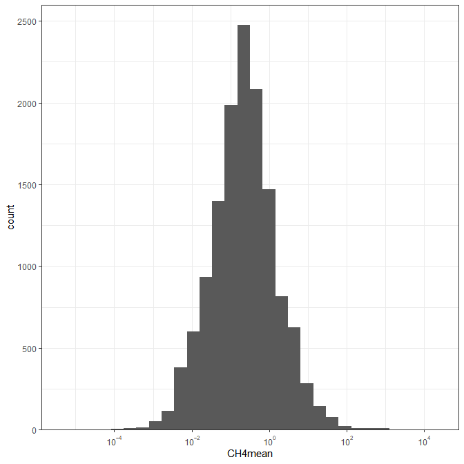
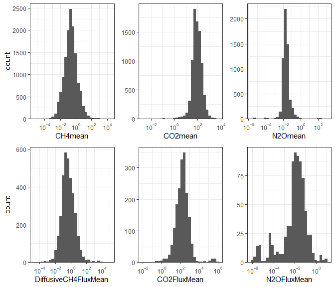

# GlobalRiverMethane (GRiMe)

A repo to enable Emily’s methane problem. Bonus features include
functions and scripts to analyze a global dataset of methane in flowing
waters.

### Setup

This repo only contains scripts and example data. The data, analyses,
figures, etc. are saved on your local dropbox folder. To use the
functions and scripts in this package, you will create an R object with
the path to your local dropbox directory. You should only need to do
this once, and all functions will access and create files within that
folder.

``` r
#Replace with your own dropbox folder location
path_to_dropbox <- "C:/Users/emsta/Dropbox/MethDB2.0" #Emily's folder
path_to_dropbox <- "C:/Users/lloken/OneDrive - DOI/GlobalRiverMethane" #Luke's USGS computer
```

There is a .rda file in the dropbox folder that contains several data
tables from the MethDB excel file. Some of column names have been
changed to remove blanks. These include `conc_df`, `flux_df`,
`sites_df`, `papers_df`, and `gis_df`. Both the concentrations and flux
tables have been converted to a common unit (uM and mmol m-2 d-1) for
all variables (CH4, CO2, N2O, nutrients)

``` r

library(dplyr)
library(ggplot2)
library(grid)

#Load custom ggplot functions
source("R/ggplot2_utils.R")

# load formatted and converted tables into your R environment
load(file.path(path_to_dropbox, "db_processingR", 
               "MethDB_tables_converted.rda"))

head(conc_df)
#> # A tibble: 6 x 68
#>   Publication_Nid Site_Nid SiteName Conc_Name `SampleDate(sta~ `SampleDate(end~
#>             <dbl> <chr>    <chr>    <chr>     <chr>            <chr>           
#> 1            2222 1000     Kytalyk~ Kytalyk ~ 42583            42583           
#> 2            2222 1000     Kytalyk~ Kytalyk ~ 42587            42587           
#> 3            2222 1000     Kytalyk~ Kytalyk ~ 42590            42590           
#> 4            2222 1001     Kytalyk~ Kytalyk ~ 42583            42583           
#> 5            2222 1001     Kytalyk~ Kytalyk ~ 42587            42587           
#> 6            2222 1001     Kytalyk~ Kytalyk ~ 42590            42590           
#> # ... with 62 more variables: SampleSeason <chr>, AggregatedSpace <chr>,
#> #   AggregatedTime <chr>, `Flux?` <chr>, CH4min <dbl>, CH4max <dbl>,
#> #   CH4mean <dbl>, CH4StDev <dbl>, CH4median <dbl>, orig_CH4unit <chr>,
#> #   SampleCount <dbl>, CO2min <dbl>, CO2max <dbl>, CO2mean <dbl>,
#> #   CO2stdev <dbl>, CO2median <dbl>, orig_CO2unit <chr>,
#> #   CO2measurementtype <chr>, N2Omin <dbl>, N2Omax <dbl>, N2Omean <dbl>,
#> #   N2Ostdev <dbl>, N2Omedian <dbl>, orig_N2Ounit <chr>, WaterTempactual <dbl>,
#> #   WaterTempest <dbl>, `ConduS/cm` <chr>, pH <chr>, `DOmg/L` <dbl>,
#> #   `DO%sat` <dbl>, NO3actual <dbl>, NO3aggregated <dbl>, orig_NO3unit <chr>,
#> #   NH4actual <dbl>, NH4aggregated <dbl>, orig_NH4unit <chr>, TNactual <dbl>,
#> #   TNaggregated <dbl>, orig_TNunit <chr>, SRPactual <dbl>,
#> #   SRPaggregated <dbl>, orig_SRPunit <chr>, TPactual <dbl>,
#> #   TPaggregated <dbl>, orig_TPunit <chr>, DOCactual <dbl>,
#> #   DOCaggregated <dbl>, orig_DOCunit <chr>, Q <dbl>, orig_Qunit <chr>,
#> #   Comments <chr>, Elevation_m <dbl>, new_CH4unit <chr>, new_CO2unit <chr>,
#> #   new_N2Ounit <chr>, new_NO3unit <chr>, new_NH4unit <chr>, new_TNunit <chr>,
#> #   new_TPunit <chr>, new_SRPunit <chr>, new_DOCunit <chr>, new_Qunit <chr>

head(flux_df)
#> # A tibble: 6 x 54
#>   Publication_Nid Site_Nid SiteName FluxName `SampleDate(start)~
#>             <dbl>    <dbl> <chr>    <chr>    <dttm>             
#> 1            2222     1000 Kytalyk~ Kytalyk~ 2016-08-01 00:00:00
#> 2            2222     1000 Kytalyk~ Kytalyk~ 2016-08-05 00:00:00
#> 3            2222     1000 Kytalyk~ Kytalyk~ 2016-08-08 00:00:00
#> 4            2222     1001 Kytalyk~ Kytalyk~ 2016-08-01 00:00:00
#> 5            2222     1001 Kytalyk~ Kytalyk~ 2016-08-05 00:00:00
#> 6            2222     1001 Kytalyk~ Kytalyk~ 2016-08-08 00:00:00
#> # ... with 49 more variables: `SampleDate(end)...6` <chr>,
#> #   SampleSeason...7 <chr>, AggregatedSpace <chr>, AggregatedTime <chr>,
#> #   DiffusiveCH4FluxMin <dbl>, DiffusiveCH4FluxMax <dbl>,
#> #   DiffusiveCH4FluxMean <dbl>, DiffusiveCH4FluxStddev <dbl>,
#> #   DiffusiveCH4FluxMedian <dbl>, DiffusiveFluxunit <chr>,
#> #   SampleCount...16 <chr>, FluxMethod <chr>, BubbleCH4FluxMin <dbl>,
#> #   BubbleCH4FluxMax <dbl>, BubbleCH4FluxMean <dbl>, BubbleCH4FluxStddev <dbl>,
#> #   BubbleCH4FluxMedian <dbl>, BubbleCH4Fluxunit <chr>, Ebullitionmethod <chr>,
#> #   `SampleDate(start)...25` <dttm>, `SampleDate(end)...26` <dttm>,
#> #   SampleSeason...27 <chr>, SampleCount...28 <dbl>, TotalCH4FluxMin <dbl>,
#> #   TotalCH4FluxMax <dbl>, TotalCH4FluxMean <dbl>, TotalCH4FluxStddev <dbl>,
#> #   TotalCH4FluxMedian <dbl>, TotalCH4FluxUnit <chr>, Totalmethod <chr>,
#> #   SampleCount...36 <dbl>, CO2FluxMin <dbl>, CO2FluxMax <dbl>,
#> #   CO2FluxMean <dbl>, CO2FluxStddev <dbl>, CO2FluxMedian <dbl>,
#> #   CO2Fluxunit <chr>, N2OFluxMin <dbl>, N2OFluxMax <dbl>, N2OFluxMean <dbl>,
#> #   N2OFluxStddev <dbl>, N2OFluxMedian <dbl>, N2OFluxunit <chr>,
#> #   Comments <chr>, new_CH4DiffusiveFluxunit <chr>,
#> #   new_CH4BubbleFluxunit <chr>, new_CH4TotalFluxunit <chr>,
#> #   new_CO2Fluxunit <chr>, new_N2OFluxunit <chr>

head(sites_df)
#> # A tibble: 6 x 23
#>   Publication_Nid Site_Nid SiteName StreamName `Aggregated?` NSitesAggregated
#>             <dbl> <chr>    <chr>    <chr>      <chr>                    <dbl>
#> 1            2222 1000     Kytalyk~ Indigirka~ No                          NA
#> 2            2222 1001     Kytalyk~ Indigirka~ No                          NA
#> 3            2222 1002     Kytalyk~ Indigirka~ No                          NA
#> 4            2222 1003     Kytalyk~ Indigirka~ No                          NA
#> 5            2223 1004     Annweil~ <NA>       No                          NA
#> 6            2223 1005     Bellhei~ <NA>       No                          NA
#> # ... with 17 more variables: `Basin/Region` <chr>, Latitude <dbl>,
#> #   Longitude <dbl>, Country <chr>, Continent <chr>, Elevation_m <dbl>,
#> #   Landuse <chr>, Channeltype <chr>, SystemSize <chr>, StrahlerOrder <dbl>,
#> #   Depth_m <chr>, Width_m <dbl>, `avgQm3/s` <chr>, Catchmentsizekm2 <dbl>,
#> #   `Targeted?` <chr>, Comments <chr>, ...23 <chr>

head(papers_df)
#> # A tibble: 6 x 10
#>   Title Authorlastname Journal PubYear Publication_Nid `Additionaldata~
#>   <chr> <chr>          <chr>   <chr>             <dbl> <chr>           
#> 1 Patt~ Abbott         Biogeo~ 2015               2297 <NA>            
#> 2 Carb~ Abril          Global~ 2005               2292 <NA>            
#> 3 Gree~ Adams          Intern~ 2009               7243 <NA>            
#> 4 Diff~ Aho            Journa~ 2019              12484 Yes             
#> 5 Expo~ Alshboul       Enviro~ 2016               2223 <NA>            
#> 6 Meth~ Anthony        Limnol~ 2012               7171 yes             
#> # ... with 4 more variables: `Embargo?` <chr>, `2xcheck` <chr>, Comments <chr>,
#> #   ...10 <chr>
```

### Example figures

Let’s plot the distribution of mean CH4 concentration.

``` r

commontheme <- list(
  theme_bw(), 
  scale_x_log10nice(omag = seq(-20, 20, 2)), 
  scale_y_continuous(expand = expansion(mult = c(0, .05)))
)

CH4mean_hist_fig <- ggplot(conc_df) +
  geom_histogram(aes(x = CH4mean)) +
  commontheme

print(CH4mean_hist_fig)
```

<!-- -->

``` r

# Save image to dropbox or another folder
# ggsave(file.path(path_to_dropbox, "db_processingR",
#                  "Figures", "CH4_meanconc_hist.png"),
#        CH4mean_hist_fig)
```

Let’s plot the distribution of mean CH4, CO2, and N2O concentration and
fluxes.

``` r

CO2mean_hist_fig <- ggplot(conc_df) +
  geom_histogram(aes(x = CO2mean)) +
  commontheme +
  theme(axis.title.y = element_blank())

# print(CO2mean_hist_fig)

N2Omean_hist_fig <- ggplot(conc_df) +
  geom_histogram(aes(x = N2Omean)) +
  commontheme +
  theme(axis.title.y = element_blank())

# print(N2Omean_hist_fig)

CH4meanflux_hist_fig <- ggplot(flux_df) +
  geom_histogram(aes(x = DiffusiveCH4FluxMean)) +
  commontheme

# print(CH4meanflux_hist_fig)

CO2meanflux_hist_fig <- ggplot(flux_df) +
  geom_histogram(aes(x = CO2FluxMean)) +
  commontheme +
  theme(axis.title.y = element_blank())

# print(CO2meanflux_hist_fig)

N2Omeanflux_hist_fig <- ggplot(flux_df) +
  geom_histogram(aes(x = N2OFluxMean)) +
  commontheme + 
  theme(axis.title.y = element_blank())

# print(N2Omeanflux_hist_fig)

# To save this figure use package "grid" 
# Need to uncomment png() and dev.off()

# png(file.path(path_to_dropbox, "db_processingR",
#                  "Figures", "Mean_gas_concflux.png"),
#     height = 6, width = 8, units = "in", res = 300)

grid.newpage()
plots <- grid.draw(rbind(cbind(ggplotGrob(CH4mean_hist_fig),
                               ggplotGrob(CO2mean_hist_fig), 
                               ggplotGrob(N2Omean_hist_fig)),
                         cbind(ggplotGrob(CH4meanflux_hist_fig),
                               ggplotGrob(CO2meanflux_hist_fig),
                               ggplotGrob(N2Omeanflux_hist_fig)),
                         size = "first"))
```

<!-- -->

``` r

# dev.off()
```
