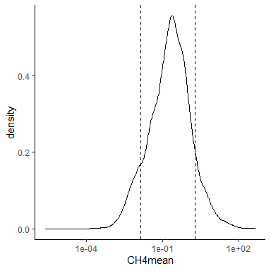

# GlobalRiverMethane (GRiMe)

A repo to enable Emily’s methane problem. Bonus features include
functions and scripts to analyze a global dataset of methane in flowing
waters.

### Setup

This repo only contains scripts and example data. The data, analyses,
figures, etc. are saved on your local dropbox folder. To use the
functions and scripts in this package, you will create an R object with
the path to your local dropbox directory. You should only need to do
this once, and all functions will access and create files within that
folder.

``` r
#Replace with your own dropbox folder location
path_to_dropbox <- "Your/local/dropbox/folder"
path_to_dropbox <- "C:/Users/lloken/OneDrive - DOI/GlobalRiverMethane"
```

### I have saved a converted rda file in the dropbox folder that contains several dataframes from the MethDB excel file. Some of column names have been changed to remove blanks.

``` r

library(dplyr)
library(ggplot2)

# load formatted and converted tables into your R environment
load(file.path(path_to_dropbox, "db_processingR", 
               "MethDB_tables_converted.rda"))

head(conc_df)
#> # A tibble: 6 x 68
#>   Publication_Nid Site_Nid SiteName Conc_Name `SampleDate(sta~ `SampleDate(end~
#>             <dbl> <chr>    <chr>    <chr>     <chr>            <chr>           
#> 1            2222 1000     Kytalyk~ Kytalyk ~ 42583            42583           
#> 2            2222 1000     Kytalyk~ Kytalyk ~ 42587            42587           
#> 3            2222 1000     Kytalyk~ Kytalyk ~ 42590            42590           
#> 4            2222 1001     Kytalyk~ Kytalyk ~ 42583            42583           
#> 5            2222 1001     Kytalyk~ Kytalyk ~ 42587            42587           
#> 6            2222 1001     Kytalyk~ Kytalyk ~ 42590            42590           
#> # ... with 62 more variables: SampleSeason <chr>, AggregatedSpace <chr>,
#> #   AggregatedTime <chr>, `Flux?` <chr>, CH4min <dbl>, CH4max <dbl>,
#> #   CH4mean <dbl>, CH4StDev <dbl>, CH4median <dbl>, orig_CH4unit <chr>,
#> #   SampleCount <dbl>, CO2min <dbl>, CO2max <dbl>, CO2mean <dbl>,
#> #   CO2stdev <dbl>, CO2median <dbl>, orig_CO2unit <chr>,
#> #   CO2measurementtype <chr>, N2Omin <dbl>, N2Omax <dbl>, N2Omean <dbl>,
#> #   N2Ostdev <dbl>, N2Omedian <dbl>, orig_N2Ounit <chr>, WaterTempactual <dbl>,
#> #   WaterTempEst <dbl>, `ConduS/cm` <chr>, pH <chr>, `DOmg/L` <dbl>,
#> #   `DO%sat` <dbl>, NO3actual <dbl>, NO3aggregated <dbl>, orig_NO3unit <chr>,
#> #   NH4actual <dbl>, NH4aggregated <dbl>, orig_NH4unit <chr>, TNactual <dbl>,
#> #   TNaggregated <dbl>, orig_TNunit <chr>, SRPactual <dbl>,
#> #   SRPaggregated <dbl>, orig_SRPunit <chr>, TPactual <dbl>,
#> #   TPaggregated <dbl>, orig_TPunit <chr>, DOCactual <dbl>,
#> #   DOCaggregated <dbl>, orig_DOCunit <chr>, Q <dbl>, orig_Qunit <chr>,
#> #   Comments <chr>, Elevation_m <dbl>, new_CH4unit <chr>, new_CO2unit <chr>,
#> #   new_N2Ounit <chr>, new_NO3unit <chr>, new_NH4unit <chr>, new_TNunit <chr>,
#> #   new_TPunit <chr>, new_SRPunit <chr>, new_DOCunit <chr>, new_Qunit <chr>
head(flux_df)
#> # A tibble: 6 x 55
#>   Publication_Nid Site_Nid SiteName Flux_Nid FluxName `SampleDate(start)~
#>             <dbl>    <dbl> <chr>       <dbl> <chr>    <dttm>             
#> 1            2222     1000 Kytalyk~       NA Kytalyk~ 2016-08-01 00:00:00
#> 2            2222     1000 Kytalyk~       NA Kytalyk~ 2016-08-05 00:00:00
#> 3            2222     1000 Kytalyk~       NA Kytalyk~ 2016-08-08 00:00:00
#> 4            2222     1001 Kytalyk~       NA Kytalyk~ 2016-08-01 00:00:00
#> 5            2222     1001 Kytalyk~       NA Kytalyk~ 2016-08-05 00:00:00
#> 6            2222     1001 Kytalyk~       NA Kytalyk~ 2016-08-08 00:00:00
#> # ... with 49 more variables: `SampleDate(end)...7` <dttm>,
#> #   SampleSeason...8 <chr>, AggregatedSpace <chr>, AggregatedTime <chr>,
#> #   DiffusiveCH4FluxMin <dbl>, DiffusiveCH4FluxMax <dbl>,
#> #   DiffusiveCH4FluxMean <dbl>, DiffusiveCH4FluxStddev <dbl>,
#> #   DiffusiveCH4FluxMedian <dbl>, DiffusiveFluxunit <chr>,
#> #   SampleCount...17 <chr>, FluxMethod <chr>, BubbleCH4FluxMin <dbl>,
#> #   BubbleCH4FluxMax <dbl>, BubbleCH4FluxMean <dbl>, BubbleCH4FluxStddev <dbl>,
#> #   BubbleCH4FluxMedian <dbl>, BubbleCH4Fluxunit <chr>, Ebullitionmethod <chr>,
#> #   `SampleDate(start)...26` <dttm>, `SampleDate(end)...27` <dttm>,
#> #   SampleSeason...28 <chr>, SampleCount...29 <dbl>, TotalCH4FluxMin <dbl>,
#> #   TotalCH4FluxMax <dbl>, TotalCH4FluxMean <dbl>, TotalCH4FluxStddev <dbl>,
#> #   TotalCH4FluxMedian <dbl>, TotalCH4FluxUnit <chr>, Totalmethod <chr>,
#> #   SampleCount...37 <dbl>, CO2FluxMin <dbl>, CO2FluxMax <dbl>,
#> #   CO2FluxMean <dbl>, CO2FluxStddev <dbl>, CO2FluxMedian <dbl>,
#> #   CO2Fluxunit <chr>, N2OFluxMin <dbl>, N2OFluxMax <dbl>, N2OFluxMean <dbl>,
#> #   N2OFluxStddev <dbl>, N2OFluxMedian <dbl>, N2OFluxunit <chr>,
#> #   Comments <chr>, new_CH4DiffusiveFluxunit <chr>,
#> #   new_CH4BubbleFluxunit <chr>, new_CH4TotalFluxunit <chr>,
#> #   new_CO2Fluxunit <chr>, new_N2OFluxunit <chr>
head(sites_df)
#> # A tibble: 6 x 23
#>   Publication_Nid Site_Nid SiteName StreamName `Aggregated?` NSitesAggregated
#>             <dbl> <chr>    <chr>    <chr>      <chr>                    <dbl>
#> 1            7227 7391     Ziwani ~ Ziwani Ri~ No                          NA
#> 2            7241 7859     ZBZ.9    Zambezi R~ No                          NA
#> 3            7241 7858     ZBZ.8    Zambezi R~ No                          NA
#> 4            7241 7857     ZBZ.7    Zambezi R~ No                          NA
#> 5            7241 7855     ZBZ.6    Zambezi R~ No                          NA
#> 6            7241 7854     ZBZ.5    Zambezi R~ No                          NA
#> # ... with 17 more variables: `Basin/Region` <chr>, Latitude <dbl>,
#> #   Longitude <dbl>, Country <chr>, Continent <chr>, Elevation_m <dbl>,
#> #   Landuse <chr>, Channeltype <chr>, SystemSize <chr>, StrahlerOrder <dbl>,
#> #   Depth_m <chr>, Width_m <dbl>, `avgQm3/s` <chr>, Catchmentsizekm2 <chr>,
#> #   `Targeted?` <chr>, Comments <chr>, ...23 <chr>
head(papers_df)
#> # A tibble: 6 x 10
#>   Title Authorlastname Journal PubYear Publication_Nid `Additionaldata~
#>   <chr> <chr>          <chr>   <chr>             <dbl> <chr>           
#> 1 Patt~ Abbott         Biogeo~ 2015               2297 <NA>            
#> 2 Carb~ Abril          Global~ 2005               2292 <NA>            
#> 3 Gree~ Adams          Intern~ 2009               7243 <NA>            
#> 4 Diff~ Aho            Journa~ 2019              12484 Yes             
#> 5 Expo~ Alshboul       Enviro~ 2016               2223 <NA>            
#> 6 Meth~ Anthony        Limnol~ 2012               7171 yes             
#> # ... with 4 more variables: `Embargo?` <chr>, `2xcheck` <chr>, Comments <chr>,
#> #   ...10 <chr>
head(gis_df)
#> # A tibble: 6 x 303
#>   Site_Nid       z lat_old lon_old   lat   lon   z_new   slope geometry hybas_id
#>   <chr>      <dbl>   <dbl>   <dbl> <dbl> <dbl>   <dbl>   <dbl> <chr>       <dbl>
#> 1 7859     7.66e+2   -17.9    25.9 -17.9  25.9 7.66e+2 2.39e-1 c(11150~   1.12e9
#> 2 7857     9.30e+2   -17.8    25.3 -17.8  25.3 9.26e+2 3.79e-3 c(11142~   1.12e9
#> 3 7855     9.40e+2   -17.5    24.2 -17.5  24.2 9.39e+2 1.45e-3 c(11119~   1.12e9
#> 4 7856     1.01e+3   -15.2    22.9 -15.2  22.9 1.01e+3 0.      c(10956~   1.12e9
#> 5 7863     4.86e-2   -18.6    36.4 -18.6  36.4 2.67e-2 7.62e-4 c(10946~  NA     
#> 6 7869     2.01e+0   -18.6    36.2 -18.6  36.2 2.00e+0 1.97e-3 c(10956~   1.12e9
#> # ... with 293 more variables: next_down_id <dbl>, next_sink_id <dbl>,
#> #   last_basin_id <dbl>, dist_sink_km <dbl>, dist_main_km <dbl>,
#> #   subcatch_area_km <dbl>, catch_area_km <dbl>, pfaf_id <dbl>, endo <dbl>,
#> #   coast <dbl>, order_river <dbl>, sort <dbl>, q_avg_m3s <dbl>,
#> #   q_min_m3s <dbl>, q_max_m3s <dbl>, runoff_mm <dbl>,
#> #   inudation_submin_per <dbl>, inudation_upmin_per <dbl>,
#> #   inudation_submax_per <dbl>, inudation_upmax_per <dbl>,
#> #   inudation_submaxlongterm_per <dbl>, inudation_upmaxlongterm_per <dbl>,
#> #   lake_area_subcatch_per <dbl>, lake_area_catch_per <dbl>,
#> #   lake_vol_millionm3 <dbl>, reservoir_vol_millionm3 <dbl>,
#> #   river_regulation_per <dbl>, river_area_sub_ha <dbl>,
#> #   river_area_up_ha <dbl>, river_volume_sub_thousandm3 <dbl>,
#> #   river_volume_up_thousandm3 <dbl>, gw_table_cm <dbl>,
#> #   elevation_sub_average_m <dbl>, elevation_up_average_m <dbl>,
#> #   elevation_sub_min_m <dbl>, elevation_sub_max_m <dbl>,
#> #   slope_sub_degrees <dbl>, slope_up_degrees <dbl>,
#> #   gradient_stream_sub_dmkm <dbl>, climate_zones <chr>, climate_strata <chr>,
#> #   air_temp_sub_avg_celsius <dbl>, air_temp_up_avg_celsius <dbl>,
#> #   air_temp_sub_min_celsius <dbl>, air_temp_sub_max_celsius <dbl>,
#> #   air_temp_sub_s01 <dbl>, air_temp_sub_s02 <dbl>, air_temp_sub_s03 <dbl>,
#> #   air_temp_sub_s04 <dbl>, air_temp_sub_s05 <dbl>, air_temp_sub_s06 <dbl>,
#> #   air_temp_sub_s07 <dbl>, air_temp_sub_s08 <dbl>, air_temp_sub_s09 <dbl>,
#> #   air_temp_sub_s10 <dbl>, air_temp_sub_s11 <dbl>, air_temp_sub_s12 <dbl>,
#> #   precip_sub_mm <dbl>, precip_up_mm <dbl>, precip_sub_s01 <dbl>,
#> #   precip_sub_s02 <dbl>, precip_sub_s03 <dbl>, precip_sub_s04 <dbl>,
#> #   precip_sub_s05 <dbl>, precip_sub_s06 <dbl>, precip_sub_s07 <dbl>,
#> #   precip_sub_s08 <dbl>, precip_sub_s09 <dbl>, precip_sub_s10 <dbl>,
#> #   precip_sub_s11 <dbl>, precip_sub_s12 <dbl>, pot_evapo_sub_avg_mm <dbl>,
#> #   pot_evapo_up_avg_mm <dbl>, pot_evapo_sub_s01 <dbl>,
#> #   pot_evapo_sub_s02 <dbl>, pot_evapo_sub_s03 <dbl>, pot_evapo_sub_s04 <dbl>,
#> #   pot_evapo_sub_s05 <dbl>, pot_evapo_sub_s06 <dbl>, pot_evapo_sub_s07 <dbl>,
#> #   pot_evapo_sub_s08 <dbl>, pot_evapo_sub_s09 <dbl>, pot_evapo_sub_s10 <dbl>,
#> #   pot_evapo_sub_s11 <dbl>, pot_evapo_sub_s12 <dbl>,
#> #   actual_evapo_sub_avg_mm <dbl>, actual_evapo_up_avg_mm <dbl>,
#> #   actual_evapo_sub_s01 <dbl>, actual_evapo_sub_s02 <dbl>,
#> #   actual_evapo_sub_s03 <dbl>, actual_evapo_sub_s04 <dbl>,
#> #   actual_evapo_sub_s05 <dbl>, actual_evapo_sub_s06 <dbl>,
#> #   actual_evapo_sub_s07 <dbl>, actual_evapo_sub_s08 <dbl>,
#> #   actual_evapo_sub_s09 <dbl>, actual_evapo_sub_s10 <dbl>,
#> #   actual_evapo_sub_s11 <dbl>, actual_evapo_sub_s12 <dbl>,
#> #   aridity_index_sub <dbl>, ...
```

### Example

``` r
CH4mean_hist_fig <- ggplot(conc_df) +
  geom_histogram(aes(x = CH4mean)) +
  scale_x_log10()

print(CH4mean_hist_fig)
```

<!-- -->

``` r

# Save to dropbox or another folder
# ggsave(file.path(path_to_dropbox, "db_processingR", 
#                  "Figures", "CH4_meanconc_hist.png"),
#        CH4mean_hist_fig)
```
