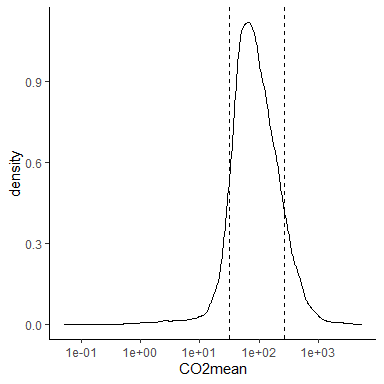

# Basic quality check of MethDB2

Document for a basic quality check of the raw data in the MethDB2,
checking mostly the extreme values for now. Also showing the original
unit of the data to double check if it is a conversion problem.

Now we can load the files with data, both the concentrations and flux
tables have been converted to a common unit (uM and mmol m-2 d-1) for
all variables (CH4, CO2, N2O, nutrients)

``` r
library(tidyverse)

#Load custom ggplot functions
source("R/ggplot2_utils.R")

# load formatted and converted tables into your R environment
load(file.path(path_to_dropbox, "db_processingR", 
               "MethDB_tables_converted.rda"))
```

### Extreme methane values

Let’s plot the distribution of mean CH4 concentration. With vertical
lines limiting the top and bottom 10% obrservations

<!-- -->

Ok let’s find which sites are the bottom 10%

<details>
<summary>
Open
</summary>
<p>

```
#> # A tibble: 458 x 4
#>     Site_Nid Publication_Nid  CH4mean unit    
#>     <chr>              <dbl>    <dbl> <chr>   
#>   1 1134                2236 0        ugC/L   
#>   2 12549              12530 0        umol/L  
#>   3 12555              12530 0        umol/L  
#>   4 12556              12530 0        umol/L  
#>   5 12557              12530 0        umol/L  
#>   6 12558              12530 0        umol/L  
#>   7 12559              12530 0        umol/L  
#>   8 12560              12530 0        umol/L  
#>   9 12561              12530 0        umol/L  
#>  10 12562              12530 0        umol/L  
#>  11 7444                7197 0        umol/L  
#>  12 7456                7245 0        umol/L  
#>  13 7677                7213 0        umol/L  
#>  14 7678                7213 0        umol/L  
#>  15 7680                7213 0        umol/L  
#>  16 7809                7240 0        ugCH4/L 
#>  17 8541                7269 0        umol/L  
#>  18 8543                7269 0        umol/L  
#>  19 8544                7269 0        umol/L  
#>  20 8549                7269 0        umol/L  
#>  21 8552                7269 0        umol/L  
#>  22 8898                2313 0        ugCH4/L 
#>  23 8904                2313 0        ugCH4/L 
#>  24 8921                2313 0        ugCH4/L 
#>  25 7574                7225 0.000005 nmol/L  
#>  26 11622              11604 0.000551 uatm CH4
#>  27 11343              11308 0.000556 uatm CH4
#>  28 11623              11604 0.000690 uatm CH4
#>  29 11357              11308 0.000707 uatm CH4
#>  30 11783              11307 0.000993 uatm CH4
#>  31 6129                7213 0.001    umol/L  
#>  32 11784              11307 0.00100  uatm CH4
#>  33 11786              11307 0.00101  uatm CH4
#>  34 11785              11307 0.00102  uatm CH4
#>  35 11621              11604 0.00115  uatm CH4
#>  36 8995                2315 0.00115  umol/L  
#>  37 11781              11307 0.00120  uatm CH4
#>  38 11774              11307 0.00121  uatm CH4
#>  39 11782              11307 0.00121  uatm CH4
#>  40 11628              11604 0.00122  uatm CH4
#>  41 8893                2313 0.00125  ugCH4/L 
#>  42 7943                7248 0.00128  ppm CH4 
#>  43 11765              11307 0.00128  uatm CH4
#>  44 11770              11307 0.00138  uatm CH4
#>  45 11780              11307 0.00139  uatm CH4
#>  46 11771              11307 0.00140  uatm CH4
#>  47 7908                7242 0.00140  ppm CH4 
#>  48 11779              11307 0.00141  uatm CH4
#>  49 11773              11307 0.00142  uatm CH4
#>  50 11769              11307 0.00151  uatm CH4
#>  51 11627              11604 0.00152  uatm CH4
#>  52 11768              11307 0.00152  uatm CH4
#>  53 11777              11307 0.00160  uatm CH4
#>  54 11764              11307 0.00160  uatm CH4
#>  55 11767              11307 0.00165  uatm CH4
#>  56 11787              11307 0.00179  uatm CH4
#>  57 2539                7248 0.00183  ppm CH4 
#>  58 7814                7240 0.00187  ugCH4/L 
#>  59 11766              11307 0.00201  uatm CH4
#>  60 12363              12362 0.00205  umol/L  
#>  61 7575                7225 0.0021   nmol/L  
#>  62 9022                2315 0.00214  umol/L  
#>  63 7667                7259 0.00215  uatm CH4
#>  64 2297                2297 0.00231  umol/L  
#>  65 11775              11307 0.00239  uatm CH4
#>  66 7668                7259 0.00241  uatm CH4
#>  67 1058                2225 0.00251  nmol/L  
#>  68 11635              11604 0.00263  uatm CH4
#>  69 11636              11604 0.00265  uatm CH4
#>  70 8347                7260 0.00275  ppm CH4 
#>  71 11762              11307 0.00281  uatm CH4
#>  72 8351                7260 0.00293  ppm CH4 
#>  73 11776              11307 0.00300  uatm CH4
#>  74 7343                7150 0.003    nmol/L  
#>  75 2198                2296 0.00318  ppm CH4 
#>  76 7351                7150 0.0032   nmol/L  
#>  77 7505                7216 0.0032   nmol/L  
#>  78 7523                7216 0.0032   nmol/L  
#>  79 11624              11604 0.00323  uatm CH4
#>  80 7455                7202 0.00326  nmol/L  
#>  81 12365              12362 0.0033   umol/L  
#>  82 7516                7216 0.0033   nmol/L  
#>  83 1766                7256 0.00337  nmol/L  
#>  84 7513                7216 0.0034   nmol/L  
#>  85 7515                7216 0.0034   nmol/L  
#>  86 7510                7216 0.0035   nmol/L  
#>  87 2502                2309 0.00355  umol/L  
#>  88 7514                7216 0.0036   nmol/L  
#>  89 7389                7227 0.00368  nmol/L  
#>  90 2234                2296 0.00370  ppm CH4 
#>  91 2000                2253 0.00371  mgC/L   
#>  92 8999                2315 0.00372  umol/L  
#>  93 1818                2281 0.00374  ugCH4/L 
#>  94 1862                2281 0.00374  ugCH4/L 
#>  95 2554                2318 0.00374  ugCH4/L 
#>  96 1990                2253 0.00376  mgC/L   
#>  97 2132                2295 0.0038   nmol/L  
#>  98 1969                2253 0.00385  mgC/L   
#>  99 2490                2309 0.00396  umol/L  
#> 100 1013                2224 0.004    umol/L  
#> 101 2159                2295 0.004    nmol/L  
#> 102 1998                2253 0.00401  mgC/L   
#> 103 9028                2315 0.00404  umol/L  
#> 104 11620              11604 0.00405  uatm CH4
#> 105 9001                2315 0.00406  umol/L  
#> 106 1974                2253 0.00410  mgC/L   
#> 107 2494                2309 0.00413  umol/L  
#> 108 9021                2315 0.00425  umol/L  
#> 109 2480                2309 0.00439  umol/L  
#> 110 7624                7225 0.0044   nmol/L  
#> 111 7545                7216 0.0045   nmol/L  
#> 112 2486                2309 0.00456  umol/L  
#> 113 7506                7216 0.0046   nmol/L  
#> 114 7537                7216 0.0046   nmol/L  
#> 115 7582                7225 0.0046   nmol/L  
#> 116 9031                2316 0.0046   umol/L  
#> 117 12364              12362 0.00463  umol/L  
#> 118 7601                7225 0.0047   nmol/L  
#> 119 7595                7225 0.00480  nmol/L  
#> 120 12089              12064 0.00488  ppm CH4 
#> 121 12259              12258 0.0049   nmol/L  
#> 122 9029                2315 0.00496  umol/L  
#> 123 2553                2318 0.00499  ugCH4/L 
#> 124 1012                2224 0.005    umol/L  
#> 125 7676                7213 0.005    umol/L  
#> 126 7592                7225 0.00510  nmol/L  
#> 127 7630                7225 0.0052   nmol/L  
#> 128 2487                2309 0.00528  umol/L  
#> 129 2498                2309 0.00529  umol/L  
#> 130 11612              11604 0.00529  uatm CH4
#> 131 11778              11307 0.00532  uatm CH4
#> 132 9018                2315 0.00535  umol/L  
#> 133 2142                2295 0.00553  nmol/L  
#> 134 2499                2309 0.00554  umol/L  
#> 135 2532                2310 0.00561  ugCH4/L 
#> 136 2145                2295 0.00563  nmol/L  
#> 137 2497                2309 0.00565  umol/L  
#> 138 9015                2315 0.00566  umol/L  
#> 139 1177                2243 0.00567  ppm CH4 
#> 140 2135                2295 0.0057   nmol/L  
#> 141 2147                2295 0.0057   nmol/L  
#> 142 2481                2309 0.00572  umol/L  
#> 143 2235                2296 0.00572  ppm CH4 
#> 144 8343                7260 0.00579  ppm CH4 
#> 145 8112                7256 0.00580  nmol/L  
#> 146 2485                2309 0.00584  umol/L  
#> 147 2134                2295 0.00585  nmol/L  
#> 148 2140                2295 0.00585  nmol/L  
#> 149 11759              11307 0.00588  uatm CH4
#> 150 9025                2315 0.00599  umol/L  
#> 151 1014                2224 0.006    umol/L  
#> 152 1488                2252 0.00606  uatm CH4
#> 153 2160                2295 0.00615  nmol/L  
#> 154 2148                2295 0.00617  nmol/L  
#> 155 2174                2296 0.00623  ppm CH4 
#> 156 7491                7216 0.00623  nmol/L  
#> 157 1821                2281 0.00623  ugCH4/L 
#> 158 1823                2281 0.00623  ugCH4/L 
#> 159 1826                2281 0.00623  ugCH4/L 
#> 160 1840                2281 0.00623  ugCH4/L 
#> 161 1861                2281 0.00623  ugCH4/L 
#> 162 1908                2281 0.00623  ugCH4/L 
#> 163 1926                2281 0.00623  ugCH4/L 
#> 164 2533                2310 0.00623  ugCH4/L 
#> 165 8652                2313 0.00623  ugCH4/L 
#> 166 8657                2313 0.00623  ugCH4/L 
#> 167 8681                2313 0.00623  ugCH4/L 
#> 168 8713                2313 0.00623  ugCH4/L 
#> 169 8751                2313 0.00623  ugCH4/L 
#> 170 8831                2313 0.00623  ugCH4/L 
#> 171 8844                2313 0.00623  ugCH4/L 
#> 172 8845                2313 0.00623  ugCH4/L 
#> 173 8846                2313 0.00623  ugCH4/L 
#> 174 8849                2313 0.00623  ugCH4/L 
#> 175 8852                2313 0.00623  ugCH4/L 
#> 176 8856                2313 0.00623  ugCH4/L 
#> 177 8859                2313 0.00623  ugCH4/L 
#> 178 8902                2313 0.00623  ugCH4/L 
#> 179 2144                2295 0.0063   nmol/L  
#> 180 1099               12840 0.00635  umol/L  
#> 181 2155                2295 0.00635  nmol/L  
#> 182 1186                2243 0.00647  ppm CH4 
#> 183 1176                2243 0.00649  ppm CH4 
#> 184 8299                7256 0.00649  nmol/L  
#> 185 2133                2295 0.00650  nmol/L  
#> 186 8044                7256 0.0065   nmol/L  
#> 187 6104                7216 0.00653  nmol/L  
#> 188 1489                2252 0.00655  uatm CH4
#> 189 8350                7260 0.00655  ppm CH4 
#> 190 2208                2296 0.00656  ppm CH4 
#> 191 7348                7150 0.0066   nmol/L  
#> 192 7618                7225 0.0066   nmol/L  
#> 193 1621               12457 0.00666  ugC/L   
#> 194 8345                7260 0.00666  ppm CH4 
#> 195 9027                2315 0.00667  umol/L  
#> 196 8546                7269 0.00667  umol/L  
#> 197 1178                2243 0.00672  ppm CH4 
#> 198 1504                2252 0.00672  uatm CH4
#> 199 11763              11307 0.00672  uatm CH4
#> 200 1140                2243 0.00679  ppm CH4 
#> 201 9004                2315 0.00682  umol/L  
#> 202 12763              11306 0.0069   nmol/L  
#> 203 1301               12485 0.007    umol/L  
#> 204 1318               12485 0.007    umol/L  
#> 205 1321               12485 0.007    umol/L  
#> 206 7410                7147 0.007    nmol/L  
#> 207 2143                2295 0.00707  nmol/L  
#> 208 11605              11604 0.00713  uatm CH4
#> 209 7544                7216 0.0072   nmol/L  
#> 210 9019                2315 0.00733  umol/L  
#> 211 12281              12258 0.00735  nmol/L  
#> 212 1142                2243 0.00736  ppm CH4 
#> 213 2495                2309 0.00738  umol/L  
#> 214 1175                2243 0.00741  ppm CH4 
#> 215 2166                2295 0.00742  nmol/L  
#> 216 2146                2295 0.00743  nmol/L  
#> 217 8136                7256 0.00746  nmol/L  
#> 218 2149                2295 0.0075   nmol/L  
#> 219 2489                2309 0.00754  umol/L  
#> 220 2154                2295 0.00760  nmol/L  
#> 221 11607              11604 0.00764  uatm CH4
#> 222 12091              12064 0.00764  ppm CH4 
#> 223 1198                2243 0.00780  ppm CH4 
#> 224 11339              11308 0.00781  uatm CH4
#> 225 2477                2309 0.00786  umol/L  
#> 226 1187                2243 0.00788  ppm CH4 
#> 227 1494                2252 0.00789  uatm CH4
#> 228 12165              11895 0.0079   nmol/L  
#> 229 9034                2316 0.00791  umol/L  
#> 230 1188                2243 0.00793  ppm CH4 
#> 231 1184                2243 0.00794  ppm CH4 
#> 232 2165                2295 0.00797  nmol/L  
#> 233 1038                2225 0.00799  nmol/L  
#> 234 1196                2243 0.00799  ppm CH4 
#> 235 1306               12485 0.008    umol/L  
#> 236 1307               12485 0.008    umol/L  
#> 237 1308               12485 0.008    umol/L  
#> 238 1309               12485 0.008    umol/L  
#> 239 1310               12485 0.008    umol/L  
#> 240 1322               12485 0.008    umol/L  
#> 241 1339               12485 0.008    umol/L  
#> 242 12082              12064 0.00803  ppm CH4 
#> 243 7511                7216 0.0081   nmol/L  
#> 244 1879                2314 0.00810  ugCH4/L 
#> 245 9023                2315 0.00829  umol/L  
#> 246 8660                2313 0.00831  ugCH4/L 
#> 247 11619              11604 0.00832  uatm CH4
#> 248 11617              11604 0.00840  uatm CH4
#> 249 1146                2243 0.00843  ppm CH4 
#> 250 9014                2315 0.00843  umol/L  
#> 251 8344                7260 0.00844  ppm CH4 
#> 252 11616              11604 0.00851  uatm CH4
#> 253 9024                2315 0.00853  umol/L  
#> 254 1192                2243 0.00854  ppm CH4 
#> 255 1484                2252 0.00858  uatm CH4
#> 256 8073                7256 0.0086   nmol/L  
#> 257 2484                2309 0.00861  umol/L  
#> 258 2276                2297 0.00864  umol/L  
#> 259 1929                2283 0.00868  umol/L  
#> 260 1189                2243 0.00870  ppm CH4 
#> 261 1201                2243 0.00870  ppm CH4 
#> 262 2137                2295 0.00873  nmol/L  
#> 263 11758              11307 0.00874  uatm CH4
#> 264 2492                2309 0.00874  umol/L  
#> 265 7318                7216 0.00877  nmol/L  
#> 266 1485                2252 0.00879  uatm CH4
#> 267 12728              11306 0.0088   nmol/L  
#> 268 1197                2243 0.00893  ppm CH4 
#> 269 1144                2243 0.00898  ppm CH4 
#> 270 1260               12485 0.009    umol/L  
#> 271 1303               12485 0.009    umol/L  
#> 272 1304               12485 0.009    umol/L  
#> 273 1319               12485 0.009    umol/L  
#> 274 1320               12485 0.009    umol/L  
#> 275 7870                7244 0.009    umol/L  
#> 276 7393                7227 0.009    nmol/L  
#> 277 1180                2243 0.00901  ppm CH4 
#> 278 2230                2296 0.00904  ppm CH4 
#> 279 7492                7216 0.00908  nmol/L  
#> 280 7543                7216 0.0091   nmol/L  
#> 281 1956                2253 0.00911  mgC/L   
#> 282 1191                2243 0.00924  ppm CH4 
#> 283 8012                7256 0.00927  nmol/L  
#> 284 1506                2252 0.00931  uatm CH4
#> 285 1179                2243 0.00932  ppm CH4 
#> 286 1863                2281 0.00935  ugCH4/L 
#> 287 1887                2281 0.00935  ugCH4/L 
#> 288 8664                2313 0.00935  ugCH4/L 
#> 289 7912                7242 0.00937  ppm CH4 
#> 290 2501                2309 0.00941  umol/L  
#> 291 1498                2252 0.00947  uatm CH4
#> 292 2253                2297 0.00960  umol/L  
#> 293 12159              11895 0.00960  nmol/L  
#> 294 1190                2243 0.00967  ppm CH4 
#> 295 2257                2297 0.00971  umol/L  
#> 296 7915                7242 0.00985  ppm CH4 
#> 297 2496                2309 0.00988  umol/L  
#> 298 2525                2310 0.00998  ugCH4/L 
#> 299 11315              11308 0.00998  uatm CH4
#> 300 12782              11306 0.00999  nmol/L  
#> 301 1317               12485 0.01     umol/L  
#> 302 1334               12485 0.01     umol/L  
#> 303 1335               12485 0.01     umol/L  
#> 304 1338               12485 0.01     umol/L  
#> 305 2449                2304 0.01     umol/L  
#> 306 7497                7216 0.01     nmol/L  
#> 307 7503                7216 0.01     nmol/L  
#> 308 7859                7241 0.01     nmol/L  
#> 309 8545                7269 0.01     umol/L  
#> 310 8547                7269 0.01     umol/L  
#> 311 1182                2243 0.0100   ppm CH4 
#> 312 1173                2243 0.0100   ppm CH4 
#> 313 8303                7256 0.0101   nmol/L  
#> 314 12088              12064 0.0101   ppm CH4 
#> 315 2444                2303 0.0101   umol/L  
#> 316 8582                2311 0.0102   nmol/L  
#> 317 8134                7256 0.0102   nmol/L  
#> 318 1490                2252 0.0103   uatm CH4
#> 319 8337                7242 0.0103   ppm CH4 
#> 320 1927                2281 0.0104   ugCH4/L 
#> 321 7388                2264 0.0104   nmol/L  
#> 322 1181                2243 0.0105   ppm CH4 
#> 323 1486                2252 0.0105   uatm CH4
#> 324 7909                7242 0.0105   ppm CH4 
#> 325 2478                2309 0.0106   umol/L  
#> 326 2510                2310 0.0106   ugCH4/L 
#> 327 2527                2310 0.0106   ugCH4/L 
#> 328 2138                2295 0.0106   nmol/L  
#> 329 1161                2243 0.0106   ppm CH4 
#> 330 2164                2295 0.0106   nmol/L  
#> 331 8583                2311 0.0107   nmol/L  
#> 332 11335              11308 0.0107   uatm CH4
#> 333 1508                2252 0.0108   uatm CH4
#> 334 12157              11895 0.0108   nmol/L  
#> 335 1622               12457 0.0108   ugC/L   
#> 336 1640               12457 0.0108   ugC/L   
#> 337 7606                7225 0.0109   nmol/L  
#> 338 11760              11307 0.0109   uatm CH4
#> 339 11378              11308 0.0110   uatm CH4
#> 340 1172                2243 0.0110   ppm CH4 
#> 341 1015                2224 0.011    umol/L  
#> 342 1305               12485 0.011    umol/L  
#> 343 1314               12485 0.011    umol/L  
#> 344 1336               12485 0.011    umol/L  
#> 345 7538                7216 0.011    nmol/L  
#> 346 1930                2283 0.0110   umol/L  
#> 347 1026                2225 0.0111   nmol/L  
#> 348 12160              11895 0.0111   nmol/L  
#> 349 8994                2315 0.0111   umol/L  
#> 350 8152                7256 0.0112   nmol/L  
#> 351 2483                2309 0.0112   umol/L  
#> 352 1747                2277 0.0112   nmol/L  
#> 353 2141                2295 0.0112   nmol/L  
#> 354 1667                2269 0.0112   ugC/L   
#> 355 1199                2243 0.0113   ppm CH4 
#> 356 11348              11308 0.0114   uatm CH4
#> 357 1938                2283 0.0114   umol/L  
#> 358 11377              11308 0.0115   uatm CH4
#> 359 8115                7256 0.0115   nmol/L  
#> 360 1946                2283 0.0116   umol/L  
#> 361 1641               12457 0.0117   ugC/L   
#> 362 1642               12457 0.0117   ugC/L   
#> 363 2158                2295 0.0118   nmol/L  
#> 364 2536                2310 0.0118   ugCH4/L 
#> 365 1495                2252 0.0119   uatm CH4
#> 366 1193                2243 0.0120   ppm CH4 
#> 367 1265               12485 0.012    umol/L  
#> 368 1333               12485 0.012    umol/L  
#> 369 11772              11307 0.0122   uatm CH4
#> 370 2139                2295 0.0123   nmol/L  
#> 371 11342              11308 0.0124   uatm CH4
#> 372 7498                7216 0.0124   nmol/L  
#> 373 1819                2281 0.0125   ugCH4/L 
#> 374 1820                2281 0.0125   ugCH4/L 
#> 375 1824                2281 0.0125   ugCH4/L 
#> 376 1832                2281 0.0125   ugCH4/L 
#> 377 1841                2281 0.0125   ugCH4/L 
#> 378 1852                2281 0.0125   ugCH4/L 
#> 379 1858                2281 0.0125   ugCH4/L 
#> 380 1875                2314 0.0125   ugCH4/L 
#> 381 1891                2281 0.0125   ugCH4/L 
#> 382 1907                2281 0.0125   ugCH4/L 
#> 383 8654                2313 0.0125   ugCH4/L 
#> 384 8658                2313 0.0125   ugCH4/L 
#> 385 8659                2313 0.0125   ugCH4/L 
#> 386 8665                2313 0.0125   ugCH4/L 
#> 387 8666                2313 0.0125   ugCH4/L 
#> 388 8668                2313 0.0125   ugCH4/L 
#> 389 8670                2313 0.0125   ugCH4/L 
#> 390 8675                2313 0.0125   ugCH4/L 
#> 391 8677                2313 0.0125   ugCH4/L 
#> 392 8678                2313 0.0125   ugCH4/L 
#> 393 8683                2313 0.0125   ugCH4/L 
#> 394 8687                2313 0.0125   ugCH4/L 
#> 395 8697                2313 0.0125   ugCH4/L 
#> 396 8700                2313 0.0125   ugCH4/L 
#> 397 8720                2313 0.0125   ugCH4/L 
#> 398 8723                2313 0.0125   ugCH4/L 
#> 399 8730                2313 0.0125   ugCH4/L 
#> 400 8752                2313 0.0125   ugCH4/L 
#> 401 8753                2313 0.0125   ugCH4/L 
#> 402 8756                2313 0.0125   ugCH4/L 
#> 403 8758                2313 0.0125   ugCH4/L 
#> 404 8759                2313 0.0125   ugCH4/L 
#> 405 8760                2313 0.0125   ugCH4/L 
#> 406 8761                2313 0.0125   ugCH4/L 
#> 407 8762                2313 0.0125   ugCH4/L 
#> 408 8766                2313 0.0125   ugCH4/L 
#> 409 8767                2313 0.0125   ugCH4/L 
#> 410 8768                2313 0.0125   ugCH4/L 
#> 411 8779                2313 0.0125   ugCH4/L 
#> 412 8780                2313 0.0125   ugCH4/L 
#> 413 8786                2313 0.0125   ugCH4/L 
#> 414 8787                2313 0.0125   ugCH4/L 
#> 415 8789                2313 0.0125   ugCH4/L 
#> 416 8790                2313 0.0125   ugCH4/L 
#> 417 8792                2313 0.0125   ugCH4/L 
#> 418 8793                2313 0.0125   ugCH4/L 
#> 419 8795                2313 0.0125   ugCH4/L 
#> 420 8805                2313 0.0125   ugCH4/L 
#> 421 8828                2313 0.0125   ugCH4/L 
#> 422 8836                2313 0.0125   ugCH4/L 
#> 423 8840                2313 0.0125   ugCH4/L 
#> 424 8851                2313 0.0125   ugCH4/L 
#> 425 8899                2313 0.0125   ugCH4/L 
#> 426 8901                2313 0.0125   ugCH4/L 
#> 427 8908                2313 0.0125   ugCH4/L 
#> 428 8942                2313 0.0125   ugCH4/L 
#> 429 8943                2313 0.0125   ugCH4/L 
#> 430 8966                2313 0.0125   ugCH4/L 
#> 431 8972                2313 0.0125   ugCH4/L 
#> 432 8973                2313 0.0125   ugCH4/L 
#> 433 8986                2314 0.0125   ugCH4/L 
#> 434 1626               12457 0.0125   ugC/L   
#> 435 2163                2295 0.0125   nmol/L  
#> 436 9002                2315 0.0125   umol/L  
#> 437 7916                7242 0.0126   ppm CH4 
#> 438 12727              11306 0.0128   nmol/L  
#> 439 1903                2281 0.0128   ugCH4/L 
#> 440 7496                7216 0.0128   nmol/L  
#> 441 2222                2296 0.0129   ppm CH4 
#> 442 7907                7245 0.0129   ppm CH4 
#> 443 2430                2303 0.0130   umol/L  
#> 444 11749              11744 0.013    umol/L  
#> 445 1262               12485 0.013    umol/L  
#> 446 1337               12485 0.013    umol/L  
#> 447 7903                7245 0.013    umol/L  
#> 448 9032                2316 0.013    umol/L  
#> 449 7914                7242 0.0131   ppm CH4 
#> 450 1095               12840 0.0132   umol/L  
#> 451 2167                2295 0.0133   nmol/L  
#> 452 8066                7256 0.0133   nmol/L  
#> 453 12711              11306 0.0134   nmol/L  
#> 454 12761              11306 0.0135   nmol/L  
#> 455 8009                7256 0.0135   nmol/L  
#> 456 8074                7256 0.0136   nmol/L  
#> 457 8627               12442 0.0137   uatm CH4
#> 458 1143                2243 0.0137   ppm CH4
```

</p>
</details>
And in which papers are those sites:
<details>
<summary>
Open
</summary>
<p>

```
#> # A tibble: 56 x 3
#>    Publication_Nid CH4mean unit    
#>              <dbl>   <dbl> <chr>   
#>  1            2236 0       ugC/L   
#>  2            7197 0       umol/L  
#>  3           12530 0       umol/L  
#>  4            7213 0.0012  umol/L  
#>  5            7248 0.00156 ppm CH4 
#>  6            7259 0.00228 uatm CH4
#>  7           11307 0.00295 uatm CH4
#>  8            7202 0.00326 nmol/L  
#>  9           12362 0.00349 umol/L  
#> 10            7269 0.004   umol/L  
#> 11           11604 0.00420 uatm CH4
#> 12            7150 0.00427 nmol/L  
#> 13            2318 0.00436 ugCH4/L 
#> 14            2253 0.00476 mgC/L   
#> 15            7225 0.00484 nmol/L  
#> 16            7240 0.00499 ugCH4/L 
#> 17            7227 0.00508 nmol/L  
#> 18            7260 0.00543 ppm CH4 
#> 19            2309 0.00565 umol/L  
#> 20            2315 0.00632 umol/L  
#> 21            7245 0.00648 umol/L  
#> 22            2224 0.0065  umol/L  
#> 23           12258 0.00653 nmol/L  
#> 24            2296 0.00676 ppm CH4 
#> 25            7147 0.007   nmol/L  
#> 26            7241 0.007   nmol/L  
#> 27            7216 0.00706 nmol/L  
#> 28            2225 0.00719 nmol/L  
#> 29            2295 0.00740 nmol/L  
#> 30            2297 0.00757 umol/L  
#> 31           12064 0.00766 ppm CH4 
#> 32            2316 0.00791 umol/L  
#> 33            2243 0.00826 ppm CH4 
#> 34            7256 0.00828 nmol/L  
#> 35           11308 0.00844 uatm CH4
#> 36            7242 0.00844 ppm CH4 
#> 37            2252 0.00890 uatm CH4
#> 38            7244 0.009   umol/L  
#> 39            2310 0.00914 ugCH4/L 
#> 40           12485 0.00942 umol/L  
#> 41            2281 0.00962 ugCH4/L 
#> 42           12840 0.00978 umol/L  
#> 43           11895 0.00985 nmol/L  
#> 44            2304 0.01    umol/L  
#> 45           11306 0.0102  nmol/L  
#> 46            2313 0.0103  ugCH4/L 
#> 47            2311 0.0104  nmol/L  
#> 48            2264 0.0104  nmol/L  
#> 49           12457 0.0107  ugC/L   
#> 50            2283 0.0107  umol/L  
#> 51            2303 0.0109  umol/L  
#> 52            2314 0.0110  ugCH4/L 
#> 53            2277 0.0112  nmol/L  
#> 54            2269 0.0112  ugC/L   
#> 55           11744 0.013   umol/L  
#> 56           12442 0.0137  uatm CH4
```

</p>
</details>

Now let’s find which sites are the top 10%

<details>
<summary>
Open
</summary>
<p>

```
#> # A tibble: 567 x 4
#>     Site_Nid Publication_Nid CH4mean unit    
#>     <chr>              <dbl>   <dbl> <chr>   
#>   1 3452                2279  399.   ugC/L   
#>   2 11594              12435  171.   ugC/L   
#>   3 1772                7256  146.   umol/L  
#>   4 6099                7192  118.   umol/L  
#>   5 1771                7256  117.   umol/L  
#>   6 1404                2308  109.   uatm CH4
#>   7 7329                7147   88.5  nmol/L  
#>   8 3374                2279   81.4  ugC/L   
#>   9 7668                7259   79.4  umol/L  
#>  10 3380                2279   77.9  ugC/L   
#>  11 2051                2292   76.4  umol/L  
#>  12 8409                7263   71.4  nmol/L  
#>  13 1011                2223   70.2  umol/L  
#>  14 12069              12032   68.8  umol/L  
#>  15 8376                7263   68.5  nmol/L  
#>  16 3071                7160   61.9  ugC/L   
#>  17 8217                7256   52.9  nmol/L  
#>  18 1770                7256   52.2  umol/L  
#>  19 3395                2279   45.4  ugC/L   
#>  20 3245                2279   45.1  ugC/L   
#>  21 12143              11743   41.5  mgC/L   
#>  22 1564                2252   39.5  uatm CH4
#>  23 3252                2279   39.4  ugC/L   
#>  24 1000                2222   39.0  mgC/L   
#>  25 8198                7256   38.3  nmol/L  
#>  26 12437              12435   37.9  ugC/L   
#>  27 7847                7241   37.8  nmol/L  
#>  28 3377                2279   36.3  ugC/L   
#>  29 8020                7256   32.9  nmol/L  
#>  30 3072                7160   32.5  ugC/L   
#>  31 3393                2279   32.3  ugC/L   
#>  32 8231                7256   31.1  nmol/L  
#>  33 12124              11743   30.9  mgC/L   
#>  34 8236                7256   30.5  nmol/L  
#>  35 2415                2302   29.6  ugC/L   
#>  36 3233                2279   28.3  ugC/L   
#>  37 1068                2226   27.7  ugCH4/L 
#>  38 8249                7256   27.6  nmol/L  
#>  39 3292                2279   26.9  ugC/L   
#>  40 12147              11743   26.3  mgC/L   
#>  41 8586                7259   25.6  umol/L  
#>  42 8023                7256   25.5  nmol/L  
#>  43 12681              12680   24.9  mgCH4/L 
#>  44 1417                7224   24.6  uatm CH4
#>  45 2409                2302   24.5  ugC/L   
#>  46 7686                7210   24    umol/L  
#>  47 8019                7256   23.9  nmol/L  
#>  48 12550              12530   23.8  umol/L  
#>  49 3457                2279   23.4  ugC/L   
#>  50 2349                2299   22.8  umol/L  
#>  51 3067                7160   22.7  ugC/L   
#>  52 8312                7256   22.7  nmol/L  
#>  53 2052                2292   22.3  umol/L  
#>  54 1436                7224   21.7  uatm CH4
#>  55 3456                2279   21.5  ugC/L   
#>  56 8204                7256   21.5  nmol/L  
#>  57 7661                7259   21.4  umol/L  
#>  58 8241                7256   21.2  nmol/L  
#>  59 2290                2297   20.9  umol/L  
#>  60 11723              11720   20.9  mgCH4/L 
#>  61 11056               7272   19.8  umol/L  
#>  62 3341                2279   19.7  ugC/L   
#>  63 11721              11721   19.0  mgCH4/L 
#>  64 8396                7263   18.4  nmol/L  
#>  65 11059               7272   18.4  umol/L  
#>  66 8200                7256   18.3  nmol/L  
#>  67 3016                2279   18.1  ugC/L   
#>  68 11393              11308   17.9  uatm CH4
#>  69 6081                7192   17.2  umol/L  
#>  70 11366              11308   17.0  uatm CH4
#>  71 12113              11743   16.4  mgC/L   
#>  72 2022                2286   16.4  umol/L  
#>  73 7875                7244   16.2  umol/L  
#>  74 12045              12032   16    umol/L  
#>  75 7783                7202   15.4  umol/L  
#>  76 8027                7256   15.3  nmol/L  
#>  77 12351              12349   15.3  umol/L  
#>  78 1420                2252   15.2  uatm CH4
#>  79 3291                2279   15.0  ugC/L   
#>  80 7337                7226   15    umol/L  
#>  81 1054                2225   15.0  nmol/L  
#>  82 2329                2298   14.9  umol/L  
#>  83 8294                7256   14.9  nmol/L  
#>  84 1406                2308   14.6  uatm CH4
#>  85 3463                2320   14.2  ugC/L   
#>  86 8268                7256   14.1  nmol/L  
#>  87 2261                2297   14.0  umol/L  
#>  88 7459                7202   13.8  umol/L  
#>  89 1610                2259   13.6  umol/L  
#>  90 8022                7256   13.3  nmol/L  
#>  91 12048              12032   13.2  umol/L  
#>  92 11722              11721   13.0  mgCH4/L 
#>  93 1079                2226   12.9  ugCH4/L 
#>  94 11331              11308   12.9  uatm CH4
#>  95 1130                2233   12.9  umol/L  
#>  96 8021                7256   12.8  nmol/L  
#>  97 8413                7263   12.7  nmol/L  
#>  98 7418                7170   12.6  umol/L  
#>  99 2011                2286   12.5  umol/L  
#> 100 8229                7256   12.4  nmol/L  
#> 101 12682              12680   12.3  mgCH4/L 
#> 102 3037                7160   12.1  ugC/L   
#> 103 7854                7241   12.1  nmol/L  
#> 104 3064                7160   12.1  ugC/L   
#> 105 1082                2227   12.1  nmol/L  
#> 106 3462                2320   12.0  ugC/L   
#> 107 12044              12032   11.7  umol/L  
#> 108 8209                7256   11.6  nmol/L  
#> 109 7449                7245   11.4  umol/L  
#> 110 3467                2320   11.4  ugC/L   
#> 111 3301                2279   11.2  ugC/L   
#> 112 7732                7259   11.0  umol/L  
#> 113 9029                2315   10.9  umol/L  
#> 114 3298                2279   10.8  ugC/L   
#> 115 8266                7256   10.6  nmol/L  
#> 116 11728              11727   10.5  uatm CH4
#> 117 1069                2226   10.4  ugCH4/L 
#> 118 8548                7269   10.3  umol/L  
#> 119 3340                2279   10.3  ugC/L   
#> 120 1611                2259   10.2  umol/L  
#> 121 3453                2279   10.1  ugC/L   
#> 122 1479                2252   10.1  uatm CH4
#> 123 7566                7225   10.0  nmol/L  
#> 124 8369                7256    9.94 nmol/L  
#> 125 2404                2302    9.82 ugC/L   
#> 126 8018                7256    9.62 nmol/L  
#> 127 1742                2277    9.55 nmol/L  
#> 128 12123              11743    9.35 mgC/L   
#> 129 1441                2252    9.14 uatm CH4
#> 130 8257                7256    9.09 nmol/L  
#> 131 1419                7224    9.06 uatm CH4
#> 132 11311              11308    9.04 uatm CH4
#> 133 8567                7269    9    umol/L  
#> 134 2459                2233    8.97 umol/L  
#> 135 2017                2286    8.91 umol/L  
#> 136 7872                7244    8.80 umol/L  
#> 137 8010                2311    8.76 nmol/L  
#> 138 2283                2297    8.65 umol/L  
#> 139 1741                2277    8.39 nmol/L  
#> 140 8218                7256    8.35 nmol/L  
#> 141 11596              11593    8.33 mgC/L   
#> 142 8194                7256    8.26 nmol/L  
#> 143 2436                2303    8.25 umol/L  
#> 144 3295                2279    8.20 ugC/L   
#> 145 3253                2279    8.16 ugC/L   
#> 146 3022                2279    8.13 ugC/L   
#> 147 6087                7192    8.07 umol/L  
#> 148 1224                2244    8.05 umol/L  
#> 149 3002                2279    8.02 ugC/L   
#> 150 1442                7224    7.88 uatm CH4
#> 151 2476                2309    7.67 umol/L  
#> 152 12043              12032    7.6  umol/L  
#> 153 3005                2279    7.56 ugC/L   
#> 154 12537              12530    7.48 umol/L  
#> 155 2458                2233    7.39 umol/L  
#> 156 2309                2298    7.34 umol/L  
#> 157 7358                7176    7.3  umol/L  
#> 158 1557                2252    7.21 uatm CH4
#> 159 1431                2252    7.21 uatm CH4
#> 160 12046              12032    7.2  umol/L  
#> 161 1684                2273    7.14 nmol/L  
#> 162 1443                2252    7.10 uatm CH4
#> 163 2262                2297    7.07 umol/L  
#> 164 8378                7263    7.00 nmol/L  
#> 165 1418                7224    6.96 uatm CH4
#> 166 2330                2298    6.93 umol/L  
#> 167 2484                2309    6.91 umol/L  
#> 168 8610                7244    6.90 umol/L  
#> 169 11058               7272    6.86 umol/L  
#> 170 8395                7263    6.80 nmol/L  
#> 171 8380                7263    6.74 nmol/L  
#> 172 12781              11306    6.71 nmol/L  
#> 173 2497                2309    6.70 umol/L  
#> 174 12042              12032    6.7  umol/L  
#> 175 2450                2304    6.69 umol/L  
#> 176 2285                2297    6.67 umol/L  
#> 177 1691                2276    6.6  umol/L  
#> 178 8197                7256    6.56 nmol/L  
#> 179 12551              12530    6.52 umol/L  
#> 180 9010                2316    6.5  umol/L  
#> 181 11395              11308    6.48 uatm CH4
#> 182 2524                2310    6.42 ugCH4/L 
#> 183 11062               7272    6.4  umol/L  
#> 184 3276                2279    6.26 ugC/L   
#> 185 8233                7256    6.16 nmol/L  
#> 186 9030                2316    6.10 umol/L  
#> 187 12552              12530    6.05 umol/L  
#> 188 7662                7259    6.04 umol/L  
#> 189 8211                7256    6.03 nmol/L  
#> 190 3065                7160    6.01 ugC/L   
#> 191 2287                2297    5.98 umol/L  
#> 192 3049                7160    5.87 ugC/L   
#> 193 1602                2256    5.84 umol/L  
#> 194 3017                2279    5.83 ugC/L   
#> 195 11312              11308    5.70 uatm CH4
#> 196 11054               7272    5.7  umol/L  
#> 197 12041              12032    5.7  umol/L  
#> 198 8608                7245    5.70 umol/L  
#> 199 2037                2289    5.69 umol/L  
#> 200 3327                2279    5.68 ugC/L   
#> 201 2021                2286    5.65 umol/L  
#> 202 7634                7225    5.65 nmol/L  
#> 203 11065               7272    5.58 umol/L  
#> 204 3009                2279    5.57 ugC/L   
#> 205 12034              12032    5.5  umol/L  
#> 206 12040              12032    5.5  umol/L  
#> 207 8207                7256    5.47 nmol/L  
#> 208 12284              12258    5.44 nmol/L  
#> 209 11332              11308    5.43 uatm CH4
#> 210 1750                2280    5.4  umol/L  
#> 211 3190                7160    5.36 ugC/L   
#> 212 2451                2304    5.33 umol/L  
#> 213 11049               7272    5.32 umol/L  
#> 214 7410                7147    5.31 nmol/L  
#> 215 1076                2226    5.31 ugCH4/L 
#> 216 7450                7202    5.26 umol/L  
#> 217 2331                2298    5.25 umol/L  
#> 218 2348                2299    5.23 umol/L  
#> 219 1428                7224    5.23 uatm CH4
#> 220 1607                2259    5.2  umol/L  
#> 221 12287              12258    5.20 nmol/L  
#> 222 3177                7160    5.17 ugC/L   
#> 223 2493                2309    5.17 umol/L  
#> 224 1422                7224    5.14 uatm CH4
#> 225 3127                7160    5.10 ugC/L   
#> 226 2036                2289    5.10 umol/L  
#> 227 8216                7256    5.09 nmol/L  
#> 228 1416                2252    5.09 uatm CH4
#> 229 8573                7269    5.04 umol/L  
#> 230 2286                2297    5.03 umol/L  
#> 231 1589                2252    5.02 uatm CH4
#> 232 7925                7248    5.02 ppm CH4 
#> 233 7651                7259    5.00 umol/L  
#> 234 7385                7227    5.00 nmol/L  
#> 235 7653                7259    4.98 umol/L  
#> 236 3334                2279    4.93 ugC/L   
#> 237 3041                7160    4.90 ugC/L   
#> 238 7457                7245    4.89 umol/L  
#> 239 1430                2252    4.86 uatm CH4
#> 240 11061               7272    4.85 umol/L  
#> 241 3331                2279    4.84 ugC/L   
#> 242 9033                2316    4.83 umol/L  
#> 243 3013                2279    4.81 ugC/L   
#> 244 12047              12032    4.8  umol/L  
#> 245 1608                2259    4.8  umol/L  
#> 246 8955                2313    4.78 ugCH4/L 
#> 247 2314                2298    4.76 umol/L  
#> 248 2270                2297    4.73 umol/L  
#> 249 7650                7259    4.72 umol/L  
#> 250 2126                2294    4.70 ppm CH4 
#> 251 12553              12530    4.68 umol/L  
#> 252 3234                2279    4.68 ugC/L   
#> 253 9009                2315    4.66 umol/L  
#> 254 2523                2310    4.64 ugCH4/L 
#> 255 3328                2279    4.63 ugC/L   
#> 256 12745              11306    4.59 nmol/L  
#> 257 7648                7259    4.58 umol/L  
#> 258 8251                7256    4.58 nmol/L  
#> 259 1421                7224    4.52 uatm CH4
#> 260 3176                7160    4.52 ugC/L   
#> 261 9027                2315    4.51 umol/L  
#> 262 11386              11308    4.49 uatm CH4
#> 263 11324              11308    4.43 uatm CH4
#> 264 8213                7256    4.40 nmol/L  
#> 265 12300              12258    4.34 nmol/L  
#> 266 3183                7160    4.33 ugC/L   
#> 267 12120              11743    4.33 mgC/L   
#> 268 1401                2252    4.32 uatm CH4
#> 269 7623                7225    4.31 nmol/L  
#> 270 12286              12258    4.29 nmol/L  
#> 271 8193                7256    4.26 nmol/L  
#> 272 8437                7263    4.24 nmol/L  
#> 273 11368              11308    4.17 uatm CH4
#> 274 2530                2310    4.14 ugCH4/L 
#> 275 1072                2226    4.13 ugCH4/L 
#> 276 3154                7160    4.12 ugC/L   
#> 277 3044                7160    4.11 ugC/L   
#> 278 12033              12032    4.1  umol/L  
#> 279 12035              12032    4.1  umol/L  
#> 280 1346                7186    4.08 ugCH4/L 
#> 281 1579                2252    4.08 uatm CH4
#> 282 8398                7263    4.08 nmol/L  
#> 283 7689                7245    4.05 umol/L  
#> 284 8187                7256    4.03 nmol/L  
#> 285 3000                2279    4.00 ugC/L   
#> 286 8391                7263    3.99 nmol/L  
#> 287 8033                7256    3.98 nmol/L  
#> 288 3003                2279    3.97 ugC/L   
#> 289 11392              11308    3.93 uatm CH4
#> 290 9013                2315    3.93 umol/L  
#> 291 11334              11308    3.90 uatm CH4
#> 292 2019                2286    3.89 umol/L  
#> 293 2306                2298    3.88 umol/L  
#> 294 8411                7263    3.87 nmol/L  
#> 295 1071                2226    3.87 ugCH4/L 
#> 296 6077                7192    3.86 umol/L  
#> 297 2039                2289    3.84 umol/L  
#> 298 2449                2304    3.84 umol/L  
#> 299 12704              11306    3.84 nmol/L  
#> 300 12391              12386    3.82 umol/L  
#> 301 12037              12032    3.8  umol/L  
#> 302 2041                2289    3.79 umol/L  
#> 303 11310              11308    3.78 uatm CH4
#> 304 7687                7202    3.73 umol/L  
#> 305 3271                2279    3.72 ugC/L   
#> 306 8572                7269    3.72 umol/L  
#> 307 3086                7160    3.72 ugC/L   
#> 308 11064               7272    3.71 umol/L  
#> 309 1403                2308    3.69 uatm CH4
#> 310 8032                7256    3.68 nmol/L  
#> 311 12108              11743    3.66 mgC/L   
#> 312 12121              11743    3.66 mgC/L   
#> 313 3001                2279    3.65 ugC/L   
#> 314 3050                7160    3.64 ugC/L   
#> 315 3045                7160    3.63 ugC/L   
#> 316 7646                7251    3.61 ugC/L   
#> 317 1134                2236    3.60 ugC/L   
#> 318 11330              11308    3.56 uatm CH4
#> 319 6079                7192    3.53 umol/L  
#> 320 12533              12530    3.49 umol/L  
#> 321 11337              11308    3.49 uatm CH4
#> 322 12469              12465    3.48 nmol/L  
#> 323 1405                2252    3.46 uatm CH4
#> 324 7467                7214    3.45 nmol/L  
#> 325 3225                2279    3.45 ugC/L   
#> 326 11369              11308    3.44 uatm CH4
#> 327 9020                2315    3.43 umol/L  
#> 328 7881                7245    3.42 umol/L  
#> 329 11350              11308    3.40 uatm CH4
#> 330 12448              12445    3.4  umol/L  
#> 331 9011                2315    3.40 umol/L  
#> 332 8467                7263    3.39 nmol/L  
#> 333 3470                2279    3.35 ugC/L   
#> 334 1609                2259    3.35 umol/L  
#> 335 3326                2279    3.35 ugC/L   
#> 336 3021                2279    3.34 ugC/L   
#> 337 6027                7151    3.33 ugC/L   
#> 338 1984                2253    3.32 mgC/L   
#> 339 1898                7240    3.29 ugCH4/L 
#> 340 1407                2252    3.28 uatm CH4
#> 341 3336                2279    3.25 ugC/L   
#> 342 9012                2315    3.25 umol/L  
#> 343 6028                7151    3.22 ugC/L   
#> 344 1144                2238    3.22 umol/L  
#> 345 1413                2252    3.21 uatm CH4
#> 346 12067              12032    3.2  umol/L  
#> 347 8383                7263    3.18 nmol/L  
#> 348 7647                7259    3.18 umol/L  
#> 349 7616                7225    3.16 nmol/L  
#> 350 12117               7245    3.16 umol/L  
#> 351 2407                2302    3.15 ugC/L   
#> 352 6030                7151    3.12 ugC/L   
#> 353 8587                7245    3.12 umol/L  
#> 354 8192                7256    3.12 nmol/L  
#> 355 11348              11308    3.11 uatm CH4
#> 356 8260                7256    3.11 nmol/L  
#> 357 3006                2279    3.10 ugC/L   
#> 358 12446              12445    3.1  umol/L  
#> 359 3139                7160    3.09 ugC/L   
#> 360 12293              12258    3.09 nmol/L  
#> 361 3419                2279    3.09 ugC/L   
#> 362 2397                2301    3.09 mgCH4/L 
#> 363 12109              11743    3.08 mgC/L   
#> 364 3054                7160    3.08 ugC/L   
#> 365 7817                7240    3.07 ugCH4/L 
#> 366 9014                2315    3.02 umol/L  
#> 367 8054                7256    3.02 nmol/L  
#> 368 11057               7272    3    umol/L  
#> 369 8105                7256    3.00 nmol/L  
#> 370 7948                7249    3.00 mgC/L   
#> 371 1477                2252    2.94 uatm CH4
#> 372 2529                2310    2.92 ugCH4/L 
#> 373 7949                7249    2.91 mgC/L   
#> 374 1064                2226    2.91 ugCH4/L 
#> 375 7759                7235    2.91 nmol/L  
#> 376 11053               7272    2.91 umol/L  
#> 377 2406                2302    2.91 ugC/L   
#> 378 12683              12680    2.91 mgCH4/L 
#> 379 7665                7259    2.89 umol/L  
#> 380 11323              11308    2.87 uatm CH4
#> 381 7649                7259    2.87 umol/L  
#> 382 3376                2279    2.87 ugC/L   
#> 383 2438                2303    2.86 umol/L  
#> 384 2551                2318    2.85 ugCH4/L 
#> 385 3057                7160    2.85 ugC/L   
#> 386 12539              12530    2.84 umol/L  
#> 387 1191                2243    2.84 ppm CH4 
#> 388 3255                2279    2.84 ugC/L   
#> 389 11575              11573    2.82 umol/L  
#> 390 8036                7256    2.81 nmol/L  
#> 391 1577                2252    2.81 uatm CH4
#> 392 1001                2222    2.80 mgC/L   
#> 393 3296                2279    2.79 ugC/L   
#> 394 8379                7263    2.79 nmol/L  
#> 395 3097                7160    2.79 ugC/L   
#> 396 2156                2295    2.78 nmol/L  
#> 397 2431                2303    2.77 umol/L  
#> 398 12762              11306    2.76 nmol/L  
#> 399 11394              11308    2.75 uatm CH4
#> 400 11333              11308    2.75 uatm CH4
#> 401 11370              11308    2.74 uatm CH4
#> 402 1726                2277    2.73 nmol/L  
#> 403 11063               7272    2.73 umol/L  
#> 404 1075                2226    2.72 ugCH4/L 
#> 405 3417                2279    2.71 ugC/L   
#> 406 8357                7264    2.7  umol/L  
#> 407 11309              11308    2.68 uatm CH4
#> 408 3263                2279    2.67 ugC/L   
#> 409 3440                2279    2.67 ugC/L   
#> 410 2040                2289    2.67 umol/L  
#> 411 3105                7160    2.67 ugC/L   
#> 412 7952                7249    2.66 mgC/L   
#> 413 12706              11306    2.65 nmol/L  
#> 414 11349              11308    2.65 uatm CH4
#> 415 8267                7256    2.64 nmol/L  
#> 416 8232                7256    2.64 nmol/L  
#> 417 3032                7160    2.64 ugC/L   
#> 418 3342                2279    2.63 ugC/L   
#> 419 11344              11308    2.63 uatm CH4
#> 420 1143                2237    2.63 umol/L  
#> 421 12467              12465    2.62 nmol/L  
#> 422 1074                2226    2.62 ugCH4/L 
#> 423 12661              12484    2.62 umol/L  
#> 424 11039               7272    2.61 umol/L  
#> 425 12039              12032    2.6  umol/L  
#> 426 8025                7256    2.59 nmol/L  
#> 427 3472                2279    2.59 ugC/L   
#> 428 1544                2252    2.58 uatm CH4
#> 429 11351              11308    2.58 uatm CH4
#> 430 3324                2279    2.58 ugC/L   
#> 431 3039                7160    2.55 ugC/L   
#> 432 12267              12258    2.55 nmol/L  
#> 433 8386                7263    2.54 nmol/L  
#> 434 3056                7160    2.54 ugC/L   
#> 435 3354                2279    2.53 ugC/L   
#> 436 7489                7216    2.51 nmol/L  
#> 437 11051               7272    2.5  umol/L  
#> 438 8356                7264    2.5  umol/L  
#> 439 2555                2318    2.50 ugCH4/L 
#> 440 2272                2297    2.49 umol/L  
#> 441 7419                7170    2.48 umol/L  
#> 442 7664                7259    2.48 umol/L  
#> 443 2043                2289    2.48 umol/L  
#> 444 2489                2309    2.47 umol/L  
#> 445 3325                2279    2.47 ugC/L   
#> 446 11750              11744    2.45 umol/L  
#> 447 11352              11308    2.45 uatm CH4
#> 448 2440                2303    2.45 umol/L  
#> 449 3226                2279    2.45 ugC/L   
#> 450 2419                2302    2.45 ugC/L   
#> 451 7356                7164    2.44 nmol/L  
#> 452 1730                2277    2.44 nmol/L  
#> 453 8293                7256    2.44 nmol/L  
#> 454 2325                2298    2.42 umol/L  
#> 455 12122              11743    2.41 mgC/L   
#> 456 8385                7263    2.41 nmol/L  
#> 457 1135                2236    2.41 ugC/L   
#> 458 12266              12258    2.41 nmol/L  
#> 459 7867                7241    2.39 nmol/L  
#> 460 8375                7263    2.39 nmol/L  
#> 461 7731                2235    2.38 ugC/L   
#> 462 7756                7235    2.38 nmol/L  
#> 463 3458                2279    2.37 ugC/L   
#> 464 2322                2298    2.37 umol/L  
#> 465 1976                2253    2.37 mgC/L   
#> 466 3115                7160    2.37 ugC/L   
#> 467 3116                7160    2.36 ugC/L   
#> 468 12330              12329    2.35 umol/L  
#> 469 3404                2279    2.34 ugC/L   
#> 470 9000                2315    2.34 umol/L  
#> 471 7857                7241    2.34 nmol/L  
#> 472 6025                7151    2.33 ugC/L   
#> 473 3421                2279    2.33 ugC/L   
#> 474 6024                7151    2.33 ugC/L   
#> 475 3036                7160    2.31 ugC/L   
#> 476 8189                7256    2.31 nmol/L  
#> 477 1438                2252    2.31 uatm CH4
#> 478 7610                7225    2.31 nmol/L  
#> 479 2347                2299    2.30 umol/L  
#> 480 3187                7160    2.30 ugC/L   
#> 481 9004                2315    2.30 umol/L  
#> 482 1452                2308    2.29 uatm CH4
#> 483 8406                7263    2.29 nmol/L  
#> 484 3033                7160    2.29 ugC/L   
#> 485 1092                2228    2.28 umol/L  
#> 486 9015                2316    2.28 umol/L  
#> 487 8615                2233    2.27 umol/L  
#> 488 8709                2313    2.26 ugCH4/L 
#> 489 12538              12530    2.26 umol/L  
#> 490 3059                7160    2.25 ugC/L   
#> 491 2042                2289    2.25 umol/L  
#> 492 3230                2279    2.24 ugC/L   
#> 493 3042                7160    2.24 ugC/L   
#> 494 12112              11743    2.23 mgC/L   
#> 495 3178                7160    2.23 ugC/L   
#> 496 3464                2320    2.22 ugC/L   
#> 497 6026                7151    2.22 ugC/L   
#> 498 12178              11895    2.22 nmol/L  
#> 499 3093                7160    2.21 ugC/L   
#> 500 7633                7226    2.2  umol/L  
#> 501 7388                2264    2.20 nmol/L  
#> 502 8034                7256    2.20 nmol/L  
#> 503 3474                2279    2.19 ugC/L   
#> 504 2335                2298    2.18 umol/L  
#> 505 2553                2318    2.18 ugCH4/L 
#> 506 11340              11308    2.18 uatm CH4
#> 507 3422                2279    2.17 ugC/L   
#> 508 3350                2279    2.17 ugC/L   
#> 509 1478                2252    2.17 uatm CH4
#> 510 7950                7249    2.16 mgC/L   
#> 511 7953                7249    2.16 mgC/L   
#> 512 3085                7160    2.16 ugC/L   
#> 513 2405                2302    2.16 ugC/L   
#> 514 8297                7256    2.16 nmol/L  
#> 515 6029                7151    2.15 ugC/L   
#> 516 7615                7225    2.15 nmol/L  
#> 517 1402                2308    2.15 uatm CH4
#> 518 7944                7248    2.11 ppm CH4 
#> 519 11060               7272    2.08 umol/L  
#> 520 3434                2279    2.08 ugC/L   
#> 521 2319                2298    2.08 umol/L  
#> 522 7443                7198    2.07 ugCH4/L 
#> 523 1073                2226    2.06 ugCH4/L 
#> 524 1444                2252    2.06 uatm CH4
#> 525 1687                7180    2.05 umol/L  
#> 526 11339              11308    2.05 uatm CH4
#> 527 7871                7244    2.04 umol/L  
#> 528 3080                7160    2.02 ugC/L   
#> 529 1434                7224    2.02 uatm CH4
#> 530 11747              11744    2.01 umol/L  
#> 531 6031                7151    2.01 ugC/L   
#> 532 2333                2298    2.00 umol/L  
#> 533 3357                2279    2.00 ugC/L   
#> 534 2332                2298    1.99 umol/L  
#> 535 12747              11306    1.99 nmol/L  
#> 536 12643              12642    1.99 umol/L  
#> 537 1683                7180    1.98 umol/L  
#> 538 3466                2320    1.98 ugC/L   
#> 539 3121                7160    1.97 ugC/L   
#> 540 3360                2279    1.97 ugC/L   
#> 541 1426                2252    1.97 uatm CH4
#> 542 3364                2279    1.97 ugC/L   
#> 543 7658                7259    1.96 umol/L  
#> 544 7947                2275    1.96 nmol/L  
#> 545 3413                2279    1.94 ugC/L   
#> 546 7458                7202    1.94 umol/L  
#> 547 12554              12530    1.93 umol/L  
#> 548 7420                7170    1.92 umol/L  
#> 549 12130              11743    1.92 mgC/L   
#> 550 7951                7249    1.92 mgC/L   
#> 551 8009                7256    1.90 nmol/L  
#> 552 6035                7151    1.90 ugC/L   
#> 553 1080                2226    1.90 ugCH4/L 
#> 554 12038              12032    1.9  umol/L  
#> 555 11374              11308    1.90 uatm CH4
#> 556 2403                2302    1.88 ugC/L   
#> 557 3329                2279    1.88 ugC/L   
#> 558 3335                2279    1.88 ugC/L   
#> 559 1002                2222    1.88 mgC/L   
#> 560 8564                7269    1.88 umol/L  
#> 561 8028                7256    1.88 nmol/L  
#> 562 1424                2252    1.87 uatm CH4
#> 563 12468              12465    1.87 nmol/L  
#> 564 8626               12442    1.87 uatm CH4
#> 565 8210                7256    1.87 nmol/L  
#> 566 3015                2279    1.86 ugC/L   
#> 567 2518                2310    1.85 ugCH4/L
```

</p>
</details>

And in which papers, sorted from high to low:

<details>
<summary>
Open
</summary>
<p>

```
#> # A tibble: 104 x 3
#>     Publication_Nid CH4mean unit    
#>               <dbl>   <dbl> <chr>   
#>   1           12435  161.   ugC/L   
#>   2            2223   70.2  umol/L  
#>   3            7147   57.3  nmol/L  
#>   4            2292   49.4  umol/L  
#>   5            2308   41.2  uatm CH4
#>   6            7210   24    umol/L  
#>   7            2222   18.2  mgC/L   
#>   8           11721   17.1  mgCH4/L 
#>   9           12349   15.3  umol/L  
#>  10            2225   15.0  nmol/L  
#>  11           12680   14.3  mgCH4/L 
#>  12            7241   13.7  nmol/L  
#>  13            7192   13.4  umol/L  
#>  14            2320   12.7  ugC/L   
#>  15           11743   12.1  mgC/L   
#>  16            7263   12.1  nmol/L  
#>  17            2227   12.1  nmol/L  
#>  18            7259   12.1  umol/L  
#>  19            2279   11.3  ugC/L   
#>  20            2299   11.1  umol/L  
#>  21           11727   10.5  uatm CH4
#>  22            7224   10.4  uatm CH4
#>  23            7256   10.4  umol/L  
#>  24           12032   10.1  umol/L  
#>  25            2297    9.91 umol/L  
#>  26           11720    9.61 mgCH4/L 
#>  27            2302    9.56 ugC/L   
#>  28            2286    9.47 umol/L  
#>  29            7170    9.15 umol/L  
#>  30            2311    8.76 nmol/L  
#>  31            7226    8.6  umol/L  
#>  32            7272    8.55 umol/L  
#>  33            2259    8.49 umol/L  
#>  34            7244    8.48 umol/L  
#>  35           12530    8.35 umol/L  
#>  36           11593    8.33 mgC/L   
#>  37            2233    8.12 umol/L  
#>  38            2244    8.05 umol/L  
#>  39            2252    8.05 uatm CH4
#>  40            7245    7.48 umol/L  
#>  41           11308    7.39 uatm CH4
#>  42            7176    7.3  umol/L  
#>  43            2273    7.14 nmol/L  
#>  44            2226    6.96 ugCH4/L 
#>  45            2309    6.85 umol/L  
#>  46            2276    6.6  umol/L  
#>  47           11306    6.36 nmol/L  
#>  48            7160    6.11 ugC/L   
#>  49            7269    6.00 umol/L  
#>  50            2315    5.85 umol/L  
#>  51            2256    5.84 umol/L  
#>  52            2277    5.78 nmol/L  
#>  53            7202    5.51 umol/L  
#>  54            2280    5.4  umol/L  
#>  55            2304    5.19 umol/L  
#>  56            7227    5.00 nmol/L  
#>  57            2294    4.70 ppm CH4 
#>  58            7225    4.68 nmol/L  
#>  59            2298    4.68 umol/L  
#>  60            2316    4.56 umol/L  
#>  61            7240    4.21 ugCH4/L 
#>  62            7114    4.19 uatm CH4
#>  63            7186    4.08 ugCH4/L 
#>  64            2310    3.99 ugCH4/L 
#>  65           12386    3.82 umol/L  
#>  66           12258    3.78 nmol/L  
#>  67            7251    3.61 ugC/L   
#>  68            7248    3.57 ppm CH4 
#>  69            7214    3.45 nmol/L  
#>  70            2303    3.42 umol/L  
#>  71            2289    3.40 umol/L  
#>  72           12445    3.25 umol/L  
#>  73            2236    3.16 ugC/L   
#>  74            2238    3.12 umol/L  
#>  75            2240    3.09 umol/L  
#>  76            2301    3.09 mgCH4/L 
#>  77            2313    2.98 ugCH4/L 
#>  78            2253    2.85 mgC/L   
#>  79            2243    2.84 ppm CH4 
#>  80           11573    2.82 umol/L  
#>  81           12465    2.81 nmol/L  
#>  82            2239    2.8  umol/L  
#>  83            2295    2.78 nmol/L  
#>  84            2318    2.63 ugCH4/L 
#>  85           12484    2.62 umol/L  
#>  86            7264    2.6  umol/L  
#>  87            7235    2.56 nmol/L  
#>  88            2241    2.54 umol/L  
#>  89            7151    2.51 ugC/L   
#>  90            7216    2.51 nmol/L  
#>  91            7249    2.47 mgC/L   
#>  92            7164    2.44 nmol/L  
#>  93            2235    2.38 ugC/L   
#>  94           12329    2.35 umol/L  
#>  95            2264    2.35 nmol/L  
#>  96           11744    2.31 umol/L  
#>  97            2228    2.28 umol/L  
#>  98           11895    2.22 nmol/L  
#>  99            7198    2.07 ugCH4/L 
#> 100            7180    2.01 umol/L  
#> 101           12642    1.99 umol/L  
#> 102            2275    1.96 nmol/L  
#> 103           12442    1.87 uatm CH4
#> 104            2237    1.86 umol/L
```

</p>
</details>

### Extreme carbon dioxide values

For the other gasses, given that the number of sites is huge, we relax
the limit to top/bottom 5%.

Let’s plot the distribution of mean CO2 concentration. With vertical
lines limiting the top and bottom 5% observations

<!-- -->

Ok let’s find which sites are the bottom 5%
<details>
<summary>
Open
</summary>
<p>

```
#> # A tibble: 277 x 4
#>     Site_Nid Publication_Nid CO2mean unit    
#>     <chr>              <dbl>   <dbl> <chr>   
#>   1 2561                2319  0.0512 umol/L  
#>   2 1189                2243  0.399  ppm CO2 
#>   3 12066              12064  0.797  ppm CO2 
#>   4 6080                7192  1.11   umol/L  
#>   5 11728              11727  1.19   uatm CO2
#>   6 12085              12064  1.29   ppm CO2 
#>   7 3114                7160  1.67   mgC/L   
#>   8 8490                7263  2.02   ppm CO2 
#>   9 8455                7263  2.06   ppm CO2 
#>  10 8456                7263  2.71   ppm CO2 
#>  11 8487                7263  2.89   ppm CO2 
#>  12 8476                7263  2.90   ppm CO2 
#>  13 8489                7263  3.22   ppm CO2 
#>  14 8488                7263  3.54   ppm CO2 
#>  15 12090              12064  3.78   ppm CO2 
#>  16 2216                2296  4      umol/L  
#>  17 8436                7263  4.26   ppm CO2 
#>  18 8008                7179  4.47   ppm CO2 
#>  19 8459                7263  4.65   ppm CO2 
#>  20 8324                7258  4.8    umol/L  
#>  21 2221                2296  5      umol/L  
#>  22 8458                7263  5.16   ppm CO2 
#>  23 7870                7244  5.31   umol/L  
#>  24 7908                7242  5.40   ppm CO2 
#>  25 12091              12064  5.81   ppm CO2 
#>  26 8323                7258  6.09   umol/L  
#>  27 8439                7263  6.53   ppm CO2 
#>  28 8609                7245  6.6    umol/L  
#>  29 2353                2299  6.65   umol/L  
#>  30 12116              11743  6.66   mgC/L   
#>  31 7581                7225  6.7    umol/L  
#>  32 8477                7263  6.92   ppm CO2 
#>  33 8486                7263  6.96   ppm CO2 
#>  34 2208                2296  7      umol/L  
#>  35 7909                7242  7.26   ppm CO2 
#>  36 8337                7242  7.31   ppm CO2 
#>  37 1149                2242  7.65   umol/L  
#>  38 7873                7244  7.78   umol/L  
#>  39 1148                2242  7.95   umol/L  
#>  40 2219                2296  8      umol/L  
#>  41 8321                7258  8.07   umol/L  
#>  42 12083              12064  8.13   ppm CO2 
#>  43 1145                2242  8.2    umol/L  
#>  44 8515                7258  8.62   umol/L  
#>  45 7902                7245  8.65   umol/L  
#>  46 7903                7245  8.81   umol/L  
#>  47 2215                2296  9      umol/L  
#>  48 8331                7258  9.05   umol/L  
#>  49 1090                2228  9.08   umol/L  
#>  50 7912                7242  9.32   ppm CO2 
#>  51 8327                7258  9.33   umol/L  
#>  52 7911                7242  9.51   ppm CO2 
#>  53 8318                7258  9.55   umol/L  
#>  54 8509                7263  9.56   ppm CO2 
#>  55 7901                7245  9.69   umol/L  
#>  56 7450                7202  9.70   uatm CO2
#>  57 7647                7259  9.94   uatm CO2
#>  58 2483                2309 10.1    umol/L  
#>  59 7574                7225 10.3    umol/L  
#>  60 8472                7263 10.5    ppm CO2 
#>  61 11784              11307 10.5    uatm CO2
#>  62 8003                7179 10.7    ppm CO2 
#>  63 2553                2318 10.7    mgCO2/L 
#>  64 7910                7242 11.0    ppm CO2 
#>  65 7855                7241 11.0    ppm CO2 
#>  66 7900                7245 11.1    umol/L  
#>  67 2136                2295 11.1    umol/L  
#>  68 7604                7225 11.2    umol/L  
#>  69 7829                7241 11.3    ppm CO2 
#>  70 1144                2237 11.4    umol/L  
#>  71 1185                2243 11.8    ppm CO2 
#>  72 1142                2237 11.8    umol/L  
#>  73 8491                7263 11.9    ppm CO2 
#>  74 1151                2242 12.1    umol/L  
#>  75 1192                2243 12.2    ppm CO2 
#>  76 8007                7179 12.3    ppm CO2 
#>  77 8592                7244 12.5    umol/L  
#>  78 1173                2243 12.7    ppm CO2 
#>  79 11936              11744 13.1    umol/L  
#>  80 12067              12032 13.3    umol/L  
#>  81 7888                7245 13.3    umol/L  
#>  82 7875                7244 13.6    umol/L  
#>  83 7624                7225 13.8    umol/L  
#>  84 11630              11604 13.8    uatm CO2
#>  85 2211                2296 14      umol/L  
#>  86 8498                7263 14.0    ppm CO2 
#>  87 1140                2237 14.0    umol/L  
#>  88 7692                7232 14.2    ppm CO2 
#>  89 7597                7225 14.2    umol/L  
#>  90 2575                2319 14.5    umol/L  
#>  91 12158              11895 14.5    ppm CO2 
#>  92 7863                7241 14.6    ppm CO2 
#>  93 7905                7245 14.6    umol/L  
#>  94 11766              11307 14.9    uatm CO2
#>  95 2214                2296 15      umol/L  
#>  96 11776              11307 15.1    uatm CO2
#>  97 11767              11307 15.1    uatm CO2
#>  98 8013                7179 15.2    ppm CO2 
#>  99 8325                7258 15.3    umol/L  
#> 100 11783              11307 15.3    uatm CO2
#> 101 11781              11307 15.3    uatm CO2
#> 102 1422                7224 15.4    uatm CO2
#> 103 7456                7202 15.5    umol/L  
#> 104 2583                2319 15.6    umol/L  
#> 105 2480                2309 15.6    umol/L  
#> 106 2144                2295 15.7    umol/L  
#> 107 11774              11307 16.0    uatm CO2
#> 108 2576                2319 16.2    umol/L  
#> 109 2477                2309 16.2    umol/L  
#> 110 7627                7225 16.3    umol/L  
#> 111 11624              11604 16.3    uatm CO2
#> 112 11782              11307 16.4    uatm CO2
#> 113 2489                2309 16.5    umol/L  
#> 114 7618                7225 16.5    umol/L  
#> 115 8069                7256 16.6    ppm CO2 
#> 116 2555                2318 16.6    mgCO2/L 
#> 117 11764              11307 16.7    uatm CO2
#> 118 11775              11307 16.7    uatm CO2
#> 119 8319                7258 16.7    umol/L  
#> 120 8074                7256 16.8    ppm CO2 
#> 121 1449                2308 16.8    uatm CO2
#> 122 8438                7263 16.9    ppm CO2 
#> 123 7689                7202 16.9    umol/L  
#> 124 11768              11307 16.9    uatm CO2
#> 125 11777              11307 17.0    uatm CO2
#> 126 2247                2296 17      umol/L  
#> 127 9010                2315 17      umol/L  
#> 128 9024                2315 17      umol/L  
#> 129 2559                2319 17.1    umol/L  
#> 130 8612                7245 17.1    umol/L  
#> 131 2495                2309 17.1    umol/L  
#> 132 8496                7263 17.2    ppm CO2 
#> 133 8014                7179 17.2    ppm CO2 
#> 134 8012                7179 17.3    ppm CO2 
#> 135 9014                2315 17.5    umol/L  
#> 136 1153                2242 17.6    umol/L  
#> 137 7623                7225 17.7    umol/L  
#> 138 7891                7245 17.7    umol/L  
#> 139 8015                7179 17.7    ppm CO2 
#> 140 11779              11307 17.8    uatm CO2
#> 141 7872                7244 17.9    umol/L  
#> 142 7785                7244 17.9    umol/L  
#> 143 8320                7258 17.9    umol/L  
#> 144 11785              11307 17.9    uatm CO2
#> 145 12159              11895 17.9    ppm CO2 
#> 146 8514                7258 17.9    umol/L  
#> 147 11620              11604 18.0    uatm CO2
#> 148 2210                2296 18      umol/L  
#> 149 8998                2315 18      umol/L  
#> 150 7603                7225 18.1    umol/L  
#> 151 8102                7256 18.1    ppm CO2 
#> 152 8497                7263 18.3    ppm CO2 
#> 153 12151              11743 18.3    mgC/L   
#> 154 8006                7179 18.4    ppm CO2 
#> 155 1176                2243 18.4    ppm CO2 
#> 156 1159                2242 18.5    umol/L  
#> 157 11765              11307 18.5    uatm CO2
#> 158 2496                2309 18.5    umol/L  
#> 159 7866                7241 18.5    ppm CO2 
#> 160 1146                2242 18.6    umol/L  
#> 161 8475                7263 18.7    ppm CO2 
#> 162 1198                2243 18.7    ppm CO2 
#> 163 7884                7245 18.7    umol/L  
#> 164 1147                2242 18.8    umol/L  
#> 165 8492                7263 18.8    ppm CO2 
#> 166 7883                7245 18.8    umol/L  
#> 167 8593                7244 18.8    umol/L  
#> 168 7335                7180 18.9    uatm CO2
#> 169 2556                2318 18.9    mgCO2/L 
#> 170 2188                2296 19      umol/L  
#> 171 8516                7258 19      umol/L  
#> 172 8598                7244 19.1    umol/L  
#> 173 7907                7245 19.2    umol/L  
#> 174 1451                2308 19.2    uatm CO2
#> 175 2140                2295 19.2    umol/L  
#> 176 2554                2318 19.3    mgCO2/L 
#> 177 7889                7245 19.3    umol/L  
#> 178 2582                2319 19.4    umol/L  
#> 179 2481                2309 19.4    umol/L  
#> 180 1143                2237 19.4    umol/L  
#> 181 1501                2252 19.4    uatm CO2
#> 182 2574                2319 19.4    umol/L  
#> 183 8611                7244 19.5    umol/L  
#> 184 2141                2295 19.5    umol/L  
#> 185 9032                2316 19.5    umol/L  
#> 186 2560                2319 19.6    umol/L  
#> 187 1977                2253 19.9    mgC/L   
#> 188 6093                7192 20      umol/L  
#> 189 7606                7225 20      umol/L  
#> 190 2568                2319 20.1    umol/L  
#> 191 8016                7179 20.1    ppm CO2 
#> 192 2142                2295 20.1    umol/L  
#> 193 11763              11307 20.2    uatm CO2
#> 194 8599                7244 20.3    umol/L  
#> 195 2571                2319 20.3    umol/L  
#> 196 2135                2295 20.4    umol/L  
#> 197 2143                2295 20.4    umol/L  
#> 198 1158                2242 20.5    umol/L  
#> 199 8068                7256 20.5    ppm CO2 
#> 200 1425                2252 20.5    uatm CO2
#> 201 1568                2252 20.6    uatm CO2
#> 202 2047                2289 20.6    umol/L  
#> 203 8105                7256 20.7    ppm CO2 
#> 204 11771              11307 20.8    uatm CO2
#> 205 11628              11604 20.8    uatm CO2
#> 206 1187                2243 20.9    ppm CO2 
#> 207 1368                2247 21      umol/L  
#> 208 2187                2296 21      umol/L  
#> 209 2573                2319 21.1    umol/L  
#> 210 8457                7263 21.2    ppm CO2 
#> 211 7893                7245 21.2    umol/L  
#> 212 2567                2319 21.2    umol/L  
#> 213 2485                2309 21.3    umol/L  
#> 214 1511                2252 21.3    uatm CO2
#> 215 8631               12442 21.3    uatm CO2
#> 216 2580                2319 21.3    umol/L  
#> 217 11635              11604 21.4    uatm CO2
#> 218 9019                2315 21.7    umol/L  
#> 219 2565                2319 21.8    umol/L  
#> 220 1527                2252 21.8    uatm CO2
#> 221 11762              11307 21.9    uatm CO2
#> 222 2167                2295 21.9    umol/L  
#> 223 2151                2295 21.9    umol/L  
#> 224 2234                2296 22      umol/L  
#> 225 2566                2319 22.1    umol/L  
#> 226 1525                2252 22.1    uatm CO2
#> 227 2570                2319 22.2    umol/L  
#> 228 1670                2269 22.2    mgC/L   
#> 229 7859                7241 22.2    ppm CO2 
#> 230 8083                7256 22.3    ppm CO2 
#> 231 12160              11895 22.3    ppm CO2 
#> 232 2581                2319 22.4    umol/L  
#> 233 7852                7241 22.4    ppm CO2 
#> 234 11772              11307 22.4    uatm CO2
#> 235 1520                2252 22.5    uatm CO2
#> 236 2501                2309 22.5    umol/L  
#> 237 2486                2309 22.6    umol/L  
#> 238 9018                2315 22.6    umol/L  
#> 239 2572                2319 22.6    umol/L  
#> 240 2487                2309 22.7    umol/L  
#> 241 1412                2252 22.7    uatm CO2
#> 242 12363              12362 22.8    umol/L  
#> 243 2498                2309 22.9    umol/L  
#> 244 2229                2296 23      umol/L  
#> 245 2233                2296 23      umol/L  
#> 246 9011                2315 23      umol/L  
#> 247 9025                2315 23      umol/L  
#> 248 1513                2252 23.1    uatm CO2
#> 249 8603                7244 23.1    umol/L  
#> 250 7871                7244 23.1    umol/L  
#> 251 1461                2308 23.1    uatm CO2
#> 252 1166                2242 23.1    umol/L  
#> 253 1175                2243 23.1    ppm CO2 
#> 254 2147                2295 23.1    umol/L  
#> 255 2584                2319 23.2    umol/L  
#> 256 2569                2319 23.2    umol/L  
#> 257 2499                2309 23.3    umol/L  
#> 258 2579                2319 23.3    umol/L  
#> 259 1160                2242 23.4    umol/L  
#> 260 8499                7263 23.5    ppm CO2 
#> 261 1125                2231 23.5    uatm CO2
#> 262 1560                2252 23.7    uatm CO2
#> 263 8322                7258 23.8    umol/L  
#> 264 2155                2295 23.9    umol/L  
#> 265 2564                2319 24.0    umol/L  
#> 266 2478                2309 24.0    umol/L  
#> 267 2189                2296 24      umol/L  
#> 268 2217                2296 24      umol/L  
#> 269 2228                2296 24      umol/L  
#> 270 2238                2296 24      umol/L  
#> 271 7444                7197 24      umol/L  
#> 272 8994                2315 24      umol/L  
#> 273 1567                2252 24.0    uatm CO2
#> 274 8635               12442 24.0    uatm CO2
#> 275 1180                2243 24.1    ppm CO2 
#> 276 8142                7256 24.1    ppm CO2 
#> 277 1178                2243 24.1    ppm CO2
```

</p>
</details>

And in which papers are those sites:

<details>
<summary>
Open
</summary>
<p>

```
#> # A tibble: 47 x 3
#>    Publication_Nid CO2mean unit    
#>              <dbl>   <dbl> <chr>   
#>  1           11727    1.19 uatm CO2
#>  2            7160    1.67 mgC/L   
#>  3           12064    3.96 ppm CO2 
#>  4            2299    6.65 umol/L  
#>  5            7242    8.43 ppm CO2 
#>  6            2228    9.08 umol/L  
#>  7            7244    9.63 umol/L  
#>  8            7263    9.63 ppm CO2 
#>  9            7259    9.94 uatm CO2
#> 10            7192   10.6  umol/L  
#> 11            7245   11.3  umol/L  
#> 12            2237   12.1  umol/L  
#> 13           11743   12.5  mgC/L   
#> 14            7258   12.8  umol/L  
#> 15           11744   13.1  umol/L  
#> 16           12032   13.3  umol/L  
#> 17            7235   13.4  ppm CO2 
#> 18            7225   14.5  umol/L  
#> 19            7232   14.5  ppm CO2 
#> 20            2242   14.7  umol/L  
#> 21            7179   14.8  ppm CO2 
#> 22            7202   14.9  uatm CO2
#> 23            7224   15.4  uatm CO2
#> 24            2243   16.0  ppm CO2 
#> 25            7241   16.5  ppm CO2 
#> 26            2296   16.7  umol/L  
#> 27           11307   17.1  uatm CO2
#> 28           11604   18.1  uatm CO2
#> 29           11895   18.3  ppm CO2 
#> 30            2318   18.8  mgCO2/L 
#> 31            7180   18.9  uatm CO2
#> 32            2309   19.1  umol/L  
#> 33            2319   19.6  umol/L  
#> 34            2308   19.7  uatm CO2
#> 35            2253   19.9  mgC/L   
#> 36            2295   20.0  umol/L  
#> 37            7256   20.3  ppm CO2 
#> 38            2316   20.3  umol/L  
#> 39            2289   20.6  umol/L  
#> 40            2247   21    umol/L  
#> 41            2315   21.3  umol/L  
#> 42            2252   22.0  uatm CO2
#> 43            2269   22.2  mgC/L   
#> 44           12442   22.7  uatm CO2
#> 45           12362   22.8  umol/L  
#> 46            2231   23.5  uatm CO2
#> 47            7197   24    umol/L
```

</p>
</details>

Now let’s find which sites are the top 5%

<details>
<summary>
Open
</summary>
<p>

```
#> # A tibble: 261 x 4
#>     Site_Nid Publication_Nid CO2mean unit    
#>     <chr>              <dbl>   <dbl> <chr>   
#>   1 2523                2310   3463. ugCO2/L 
#>   2 2524                2310   2435. ugCO2/L 
#>   3 2518                2310   2209. ugCO2/L 
#>   4 3226                2279   2150. mgC/L   
#>   5 2513                2310   1974. ugCO2/L 
#>   6 3452                2279   1894. mgC/L   
#>   7 2423                2302   1689. mgC/L   
#>   8 12069              12032   1551. umol/L  
#>   9 1607                2259   1548. umol/L  
#>  10 7585                7225   1448. umol/L  
#>  11 3233                2279   1385. mgC/L   
#>  12 2530                2310   1370. ugCO2/L 
#>  13 1610                2259   1341  umol/L  
#>  14 7593                7225   1335. umol/L  
#>  15 3223                2279   1318. mgC/L   
#>  16 2503                2310   1308. ugCO2/L 
#>  17 3227                2279   1294. mgC/L   
#>  18 3224                2279   1282. mgC/L   
#>  19 7583                7225   1242. umol/L  
#>  20 7750                7235   1219. ppm CO2 
#>  21 1611                2259   1213. umol/L  
#>  22 3380                2279   1206. mgC/L   
#>  23 2290                2297   1191. umol/L  
#>  24 3225                2279   1169. mgC/L   
#>  25 3221                2279   1168. mgC/L   
#>  26 8359                7264   1167. umol/L  
#>  27 11594              12435   1126. mgC/L   
#>  28 3220                2279   1102. mgC/L   
#>  29 2420                2302   1033. mgC/L   
#>  30 7572                2305   1004. ppm CO2 
#>  31 2419                2302    992. mgC/L   
#>  32 11952              11744    968. umol/L  
#>  33 1609                2259    932. umol/L  
#>  34 1191                2243    931. ppm CO2 
#>  35 9030                2316    929  umol/L  
#>  36 3341                2279    921. mgC/L   
#>  37 1404                2308    920. uatm CO2
#>  38 2526                2310    882. ugCO2/L 
#>  39 11745              11744    867. umol/L  
#>  40 2265                2297    853. umol/L  
#>  41 12365              12362    841. umol/L  
#>  42 1608                2259    836  umol/L  
#>  43 6099                7192    833. umol/L  
#>  44 12538              12530    824. umol/L  
#>  45 7472                7215    823. umol/L  
#>  46 1198                2243    810. ppm CO2 
#>  47 3016                2279    799. mgC/L   
#>  48 3222                2279    799. mgC/L   
#>  49 2301                2298    790. umol/L  
#>  50 2041                2289    780. umol/L  
#>  51 3002                2279    774. mgC/L   
#>  52 1564                2252    765. uatm CO2
#>  53 11059               7272    748. uatm CO2
#>  54 8409                7263    747. ppm CO2 
#>  55 1222                2244    742  umol/L  
#>  56 9027                2315    734  umol/L  
#>  57 3374                2279    734. mgC/L   
#>  58 2286                2297    733. umol/L  
#>  59 2299                2298    727. umol/L  
#>  60 2302                2298    727. umol/L  
#>  61 2329                2298    722. umol/L  
#>  62 2529                2310    720. ugCO2/L 
#>  63 7753                7235    720. ppm CO2 
#>  64 2298                2298    712. umol/L  
#>  65 8376                7263    704. ppm CO2 
#>  66 2300                2298    700. umol/L  
#>  67 1144                2238    683. umol/L  
#>  68 2283                2297    674. umol/L  
#>  69 2484                2309    671. umol/L  
#>  70 12040              12032    666. umol/L  
#>  71 3350                2279    666. mgC/L   
#>  72 12147              11743    664. mgC/L   
#>  73 12363              12362    662  umol/L  
#>  74 3291                2279    655. mgC/L   
#>  75 3395                2279    654. mgC/L   
#>  76 3472                2279    650. mgC/L   
#>  77 3252                2279    649. mgC/L   
#>  78 2505                2310    645. ugCO2/L 
#>  79 2303                2298    644. umol/L  
#>  80 1200                2243    643. ppm CO2 
#>  81 1201                2243    637. ppm CO2 
#>  82 7633                7226    634  umol/L  
#>  83 7457                7202    630. umol/L  
#>  84 12437              12435    626. mgC/L   
#>  85 3005                2279    624. mgC/L   
#>  86 3265                2279    622. mgC/L   
#>  87 9029                2315    622. umol/L  
#>  88 3244                2279    621. mgC/L   
#>  89 2349                2299    615. umol/L  
#>  90 3017                2279    608. mgC/L   
#>  91 8231                7256    607. ppm CO2 
#>  92 2504                2310    605. ugCO2/L 
#>  93 2444                2303    603. umol/L  
#>  94 3377                2279    602. mgC/L   
#>  95 11056               7272    599. uatm CO2
#>  96 12124              11743    599. mgC/L   
#>  97 3067                7160    598. mgC/L   
#>  98 3228                2279    597. mgC/L   
#>  99 12364              12362    597  umol/L  
#> 100 2497                2309    593. umol/L  
#> 101 3326                2279    591. mgC/L   
#> 102 2489                2309    589. umol/L  
#> 103 12330              12329    583  umol/L  
#> 104 3072                7160    576. mgC/L   
#> 105 8200                7256    571. ppm CO2 
#> 106 2304                2298    571. umol/L  
#> 107 2264                2297    567. umol/L  
#> 108 2527                2310    567. ugCO2/L 
#> 109 3259                2279    567. mgC/L   
#> 110 8209                7256    566. ppm CO2 
#> 111 2474                2308    565. uatm CO2
#> 112 1010                2223    562  umol/L  
#> 113 2525                2310    560. ugCO2/L 
#> 114 3302                2279    559. mgC/L   
#> 115 3021                2279    558. mgC/L   
#> 116 8023                7256    555. ppm CO2 
#> 117 11721              11721    550. mgCO2/L 
#> 118 7299                7218    550. uatm CO2
#> 119 1000                2222    549. mgC/L   
#> 120 3463                2320    547. mgC/L   
#> 121 2521                2310    546. ugCO2/L 
#> 122 3348                2279    545. mgC/L   
#> 123 3401                2279    545. mgC/L   
#> 124 8194                7256    544. ppm CO2 
#> 125 6081                7192    541. umol/L  
#> 126 3047                7160    539. mgC/L   
#> 127 3375                2279    535. mgC/L   
#> 128 8217                7256    534. ppm CO2 
#> 129 2405                2302    534. mgC/L   
#> 130 2410                2302    533. mgC/L   
#> 131 3000                2279    533. mgC/L   
#> 132 8249                7256    532. ppm CO2 
#> 133 8198                7256    532. ppm CO2 
#> 134 2531                2310    530. ugCO2/L 
#> 135 7567                7225    528. umol/L  
#> 136 2279                2297    526. umol/L  
#> 137 8019                7256    523. ppm CO2 
#> 138 2309                2298    522. umol/L  
#> 139 11596              11593    516. mgC/L   
#> 140 3437                2279    515. mgC/L   
#> 141 6128                7215    515. umol/L  
#> 142 8236                7256    511. ppm CO2 
#> 143 8204                7256    510. ppm CO2 
#> 144 6079                7192    509. umol/L  
#> 145 3456                2279    507. mgC/L   
#> 146 3039                7160    500. mgC/L   
#> 147 7881                7245    498. umol/L  
#> 148 7747                7235    497. ppm CO2 
#> 149 7754                7235    496. ppm CO2 
#> 150 3462                2320    494. mgC/L   
#> 151 3393                2279    491. mgC/L   
#> 152 12466              12465    490  umol/L  
#> 153 2506                2310    488. ugCO2/L 
#> 154 1436                7224    486. uatm CO2
#> 155 11749              11744    485. umol/L  
#> 156 8413                7263    485. ppm CO2 
#> 157 2400                2302    484. mgC/L   
#> 158 3006                2279    483. mgC/L   
#> 159 12036              12032    482. umol/L  
#> 160 1095                2228    482. umol/L  
#> 161 7873                7244    479. umol/L  
#> 162 8268                7256    479. ppm CO2 
#> 163 7566                7225    478. umol/L  
#> 164 7337                7226    478  umol/L  
#> 165 1403                2308    477. uatm CO2
#> 166 9001                2315    476. umol/L  
#> 167 3276                2279    476. mgC/L   
#> 168 3467                2320    476. mgC/L   
#> 169 2522                2310    476. ugCO2/L 
#> 170 8385                7263    475. ppm CO2 
#> 171 3037                7160    475. mgC/L   
#> 172 8598                7244    473. umol/L  
#> 173 12550              12530    472  umol/L  
#> 174 9034                2316    472  umol/L  
#> 175 2520                2310    471. ugCO2/L 
#> 176 7599                7225    471  umol/L  
#> 177 12143              11743    469. mgC/L   
#> 178 7459                7202    468. umol/L  
#> 179 8020                7256    465. ppm CO2 
#> 180 2348                2299    465. umol/L  
#> 181 2512                2310    463. ugCO2/L 
#> 182 2487                2309    462. umol/L  
#> 183 8018                7256    461. ppm CO2 
#> 184 1182                2243    460. ppm CO2 
#> 185 3019                2279    458. mgC/L   
#> 186 12043              12032    457. umol/L  
#> 187 2476                2309    456. umol/L  
#> 188 3301                2279    456. mgC/L   
#> 189 1183                2243    455. ppm CO2 
#> 190 11750              11744    455. umol/L  
#> 191 1118                7228    454. umol/L  
#> 192 12344              12342    454. uatm CO2
#> 193 1199                2243    453. ppm CO2 
#> 194 8375                7263    450. ppm CO2 
#> 195 2431                2303    450. umol/L  
#> 196 3018                2279    450. mgC/L   
#> 197 3022                2279    450. mgC/L   
#> 198 3453                2279    450. mgC/L   
#> 199 8189                7256    448. ppm CO2 
#> 200 3065                7160    448. mgC/L   
#> 201 8233                7256    448. ppm CO2 
#> 202 2178                2296    448  umol/L  
#> 203 3253                2279    447. mgC/L   
#> 204 8193                7256    445. ppm CO2 
#> 205 11722              11721    445. mgCO2/L 
#> 206 2436                2303    445. umol/L  
#> 207 2306                2298    444. umol/L  
#> 208 3293                2279    444. mgC/L   
#> 209 2448                2303    442. umol/L  
#> 210 8383                7263    441. ppm CO2 
#> 211 8229                7256    440. ppm CO2 
#> 212 2432                2303    440. umol/L  
#> 213 3176                7160    440. mgC/L   
#> 214 8216                7256    439. ppm CO2 
#> 215 3058                7160    439. mgC/L   
#> 216 8241                7256    438. ppm CO2 
#> 217 3041                7160    438. mgC/L   
#> 218 11752              11744    435. umol/L  
#> 219 9031                2316    433  umol/L  
#> 220 3331                2279    433. mgC/L   
#> 221 2429                2303    432. umol/L  
#> 222 7833                7241    431. ppm CO2 
#> 223 12467              12465    430  umol/L  
#> 224 12469              12465    430  umol/L  
#> 225 7634                7225    429. umol/L  
#> 226 3099                7160    429. mgC/L   
#> 227 3457                2279    429. mgC/L   
#> 228 2406                2302    428. mgC/L   
#> 229 2287                2297    428. umol/L  
#> 230 8177                7256    428. ppm CO2 
#> 231 1417                7224    426. uatm CO2
#> 232 3255                2279    424. mgC/L   
#> 233 2516                2310    424. ugCO2/L 
#> 234 3078                7160    424. mgC/L   
#> 235 3465                2320    423. mgC/L   
#> 236 1196                2243    422. ppm CO2 
#> 237 7847                7241    422. ppm CO2 
#> 238 8395                7263    419. ppm CO2 
#> 239 11933              11744    418. umol/L  
#> 240 8226                7256    417. ppm CO2 
#> 241 1477                2252    415. uatm CO2
#> 242 6080                7192    414. umol/L  
#> 243 12131              11743    414. mgC/L   
#> 244 8378                7263    412. ppm CO2 
#> 245 11053               7272    411. uatm CO2
#> 246 3068                7160    409. mgC/L   
#> 247 3236                2279    408. mgC/L   
#> 248 3290                2279    407. mgC/L   
#> 249 2509                2310    407. ugCO2/L 
#> 250 7616                7225    406. umol/L  
#> 251 8382                7263    405. ppm CO2 
#> 252 1442                7224    405. uatm CO2
#> 253 7746                7235    405. ppm CO2 
#> 254 3245                2279    404. mgC/L   
#> 255 3231                2279    404. mgC/L   
#> 256 8586                7259    404. uatm CO2
#> 257 7834                7241    402. ppm CO2 
#> 258 3013                2279    400. mgC/L   
#> 259 1406                2252    399. uatm CO2
#> 260 2184                2296    399  umol/L  
#> 261 8187                7256    398. ppm CO2
```

</p>
</details>

And in which papers:

<details>
<summary>
Open
</summary>
<p>

```
#> # A tibble: 56 x 3
#>    Publication_Nid CO2mean unit    
#>              <dbl>   <dbl> <chr>   
#>  1            7264   1167. umol/L  
#>  2            2259   1144  umol/L  
#>  3           12435   1091. mgC/L   
#>  4            2310   1027. ugCO2/L 
#>  5            2305   1004. ppm CO2 
#>  6            2279    958. mgC/L   
#>  7            2297    817. umol/L  
#>  8            2302    814. mgC/L   
#>  9            7225    792. umol/L  
#> 10           12032    789. umol/L  
#> 11            2289    780. umol/L  
#> 12            2240    766. umol/L  
#> 13            2244    742  umol/L  
#> 14            2308    720. uatm CO2
#> 15            2241    710  umol/L  
#> 16           12362    705. umol/L  
#> 17            7235    676. ppm CO2 
#> 18            7215    669. umol/L  
#> 19            7202    661. umol/L  
#> 20            2298    656. umol/L  
#> 21            2238    652. umol/L  
#> 22            2315    645. umol/L  
#> 23           11744    641. umol/L  
#> 24            2239    603. umol/L  
#> 25            2309    602. umol/L  
#> 26            2243    590. ppm CO2 
#> 27           12530    589. umol/L  
#> 28            7272    586. uatm CO2
#> 29           12329    583  umol/L  
#> 30            7192    574. umol/L  
#> 31            2299    569. umol/L  
#> 32            2223    562  umol/L  
#> 33            7226    556  umol/L  
#> 34            7218    550. uatm CO2
#> 35            2222    549. mgC/L   
#> 36           11743    536. mgC/L   
#> 37            2320    534. mgC/L   
#> 38           11593    516. mgC/L   
#> 39            7245    509. umol/L  
#> 40            7263    504. ppm CO2 
#> 41            2252    498. uatm CO2
#> 42            2316    497. umol/L  
#> 43            7256    491. ppm CO2 
#> 44           11721    488. mgCO2/L 
#> 45           11720    482. mgCO2/L 
#> 46            2228    482. umol/L  
#> 47            7160    480. mgC/L   
#> 48            7244    476. umol/L  
#> 49            2303    476. umol/L  
#> 50            7228    454. umol/L  
#> 51           12342    454. uatm CO2
#> 52            7224    454. uatm CO2
#> 53           12465    445  umol/L  
#> 54            2296    424. umol/L  
#> 55            7241    419. ppm CO2 
#> 56            7259    404. uatm CO2
```

</p>
</details>

### Extreme nitrous oxide values

Let’s plot the distribution of mean N2O concentration. With vertical
lines limiting the top and bottom 5% observations

<!-- -->

Ok let’s find which sites are the bottom 5%

<details>
<summary>
Open
</summary>
<p>

```
#> # A tibble: 148 x 4
#>     Site_Nid Publication_Nid    N2Omean unit    
#>     <chr>              <dbl>      <dbl> <chr>   
#>   1 1090                2228 0          umol/L  
#>   2 11721              11721 0          ugN2O/L 
#>   3 12033              12032 0          umol/L  
#>   4 12034              12032 0          umol/L  
#>   5 12035              12032 0          umol/L  
#>   6 12036              12032 0          umol/L  
#>   7 12037              12032 0          umol/L  
#>   8 12038              12032 0          umol/L  
#>   9 12039              12032 0          umol/L  
#>  10 12040              12032 0          umol/L  
#>  11 12041              12032 0          umol/L  
#>  12 12042              12032 0          umol/L  
#>  13 12043              12032 0          umol/L  
#>  14 12044              12032 0          umol/L  
#>  15 12045              12032 0          umol/L  
#>  16 12046              12032 0          umol/L  
#>  17 12047              12032 0          umol/L  
#>  18 12048              12032 0          umol/L  
#>  19 12067              12032 0          umol/L  
#>  20 12068              12032 0          umol/L  
#>  21 12069              12032 0          umol/L  
#>  22 12070              12032 0          umol/L  
#>  23 12683              12680 0          ugN2O/L 
#>  24 8218                7256 0          nmol/L  
#>  25 2049                2289 0.00000483 nmol/L  
#>  26 7666               12840 0.0000465  nmol/L  
#>  27 2043                2289 0.0000549  nmol/L  
#>  28 2034                2289 0.0000585  nmol/L  
#>  29 2042                2289 0.0000649  nmol/L  
#>  30 2041                2289 0.0000736  nmol/L  
#>  31 7295                7223 0.0001     umol/L  
#>  32 8236                7256 0.00019    nmol/L  
#>  33 8023                7256 0.000300   nmol/L  
#>  34 2046                2289 0.000397   nmol/L  
#>  35 2047                2289 0.000573   nmol/L  
#>  36 8197                7256 0.00059    nmol/L  
#>  37 2045                2289 0.000732   nmol/L  
#>  38 2048                2289 0.000752   nmol/L  
#>  39 2035                2289 0.000843   nmol/L  
#>  40 8198                7256 0.00088    nmol/L  
#>  41 2037                2289 0.000880   nmol/L  
#>  42 2036                2289 0.000935   nmol/L  
#>  43 8216                7256 0.00104    nmol/L  
#>  44 2039                2289 0.00115    nmol/L  
#>  45 2038                2289 0.00125    nmol/L  
#>  46 8204                7256 0.00126    nmol/L  
#>  47 2040                2289 0.00127    nmol/L  
#>  48 2044                2289 0.00142    nmol/L  
#>  49 8376                7263 0.00159    nmol/L  
#>  50 8231                7256 0.0016     nmol/L  
#>  51 2496                2309 0.00169    umol/L  
#>  52 8019                7256 0.00170    nmol/L  
#>  53 8020                7256 0.00172    nmol/L  
#>  54 8200                7256 0.00175    nmol/L  
#>  55 8411                7263 0.0018     nmol/L  
#>  56 2033                2289 0.00190    nmol/L  
#>  57 2494                2309 0.00194    umol/L  
#>  58 8226                7256 0.00196    nmol/L  
#>  59 2032                2289 0.00198    nmol/L  
#>  60 2491                2309 0.00207    umol/L  
#>  61 8233                7256 0.00212    nmol/L  
#>  62 8018                7256 0.00224    nmol/L  
#>  63 11722              11721 0.00234    ugN2O/L 
#>  64 2499                2309 0.00258    umol/L  
#>  65 8229                7256 0.0026     nmol/L  
#>  66 7847                7241 0.00265    nmol/L  
#>  67 8409                7263 0.0027     nmol/L  
#>  68 8375                7263 0.00284    nmol/L  
#>  69 8268                7256 0.00309    nmol/L  
#>  70 1741                2277 0.00321    nmol/L  
#>  71 8213                7256 0.00329    nmol/L  
#>  72 8217                7256 0.00332    nmol/L  
#>  73 8382                7263 0.00335    nmol/L  
#>  74 7833                7241 0.00345    nmol/L  
#>  75 8369                7256 0.00346    nmol/L  
#>  76 8385                7263 0.00369    nmol/L  
#>  77 7854                7241 0.00380    nmol/L  
#>  78 2476                2309 0.00381    umol/L  
#>  79 8361                7256 0.00384    nmol/L  
#>  80 7868                7241 0.0039     nmol/L  
#>  81 8249                7256 0.00399    nmol/L  
#>  82 11628              11604 0.00399    uatm N2O
#>  83 8360                7256 0.00402    nmol/L  
#>  84 8293                7256 0.00409    nmol/L  
#>  85 11623              11604 0.00413    uatm N2O
#>  86 11622              11604 0.00417    uatm N2O
#>  87 2493                2309 0.00419    umol/L  
#>  88 1714                2277 0.00421    nmol/L  
#>  89 12066              12064 0.00421    ppm N2O 
#>  90 8202                7256 0.00422    nmol/L  
#>  91 8267                7256 0.00429    nmol/L  
#>  92 8395                7263 0.00464    nmol/L  
#>  93 2487                2309 0.00464    umol/L  
#>  94 8177                7256 0.00468    nmol/L  
#>  95 2477                2309 0.00474    umol/L  
#>  96 11629              11604 0.00474    uatm N2O
#>  97 8192                7256 0.00478    nmol/L  
#>  98 2500                2309 0.00480    umol/L  
#>  99 7629                7225 0.00480    nmol/L  
#> 100 2488                2309 0.00484    umol/L  
#> 101 1721                2277 0.00486    nmol/L  
#> 102 1711                2277 0.00489    nmol/L  
#> 103 7834                7241 0.0049     nmol/L  
#> 104 2495                2309 0.00503    umol/L  
#> 105 8207                7256 0.00505    nmol/L  
#> 106 8010                2311 0.00505    nmol/L  
#> 107 1712                2277 0.00506    nmol/L  
#> 108 8227                7256 0.00509    nmol/L  
#> 109 11630              11604 0.00513    uatm N2O
#> 110 8292                7256 0.00525    nmol/L  
#> 111 7829                7241 0.0053     nmol/L  
#> 112 7850                7241 0.0053     nmol/L  
#> 113 7857                7241 0.0053     nmol/L  
#> 114 1710                2277 0.00541    nmol/L  
#> 115 1715                2277 0.00543    nmol/L  
#> 116 2270                2297 0.00548    umol/L  
#> 117 1722                2277 0.00551    nmol/L  
#> 118 2484                2309 0.00551    umol/L  
#> 119 8383                7263 0.00554    nmol/L  
#> 120 8266                7256 0.00555    nmol/L  
#> 121 8391                7263 0.00556    nmol/L  
#> 122 8209                7256 0.00568    nmol/L  
#> 123 7848                7241 0.00580    nmol/L  
#> 124 7858                7241 0.00580    nmol/L  
#> 125 1713                2277 0.00583    nmol/L  
#> 126 1781                7256 0.00585    nmol/L  
#> 127 7609                7225 0.0059     nmol/L  
#> 128 7623                7225 0.0059     nmol/L  
#> 129 7863                7241 0.0059     nmol/L  
#> 130 8396                7263 0.00592    nmol/L  
#> 131 2492                2309 0.00592    umol/L  
#> 132 8388                7263 0.00593    nmol/L  
#> 133 2501                2309 0.00593    umol/L  
#> 134 7830                7241 0.00595    nmol/L  
#> 135 7329                7147 0.006      nmol/L  
#> 136 7382                7227 0.006      nmol/L  
#> 137 7388                2264 0.006      nmol/L  
#> 138 7397                7227 0.006      nmol/L  
#> 139 7547                7227 0.006      nmol/L  
#> 140 7827                7241 0.006      nmol/L  
#> 141 2498                2309 0.00602    umol/L  
#> 142 8384                7263 0.00608    nmol/L  
#> 143 1691                2276 0.00610    nmol/L  
#> 144 7692                7235 0.00610    nmol/L  
#> 145 7832                7241 0.00610    nmol/L  
#> 146 7845                7241 0.00610    nmol/L  
#> 147 2443                2303 0.00612    umol/L  
#> 148 2289                2297 0.00613    umol/L
```

</p>
</details>

And in which papers are those sites:

<details>
<summary>
Open
</summary>
<p>

```
#> # A tibble: 23 x 3
#>    Publication_Nid   N2Omean unit    
#>              <dbl>     <dbl> <chr>   
#>  1            2228 0         umol/L  
#>  2           12032 0         umol/L  
#>  3           12680 0         ugN2O/L 
#>  4           12840 0.0000465 nmol/L  
#>  5            7223 0.0001    umol/L  
#>  6            2289 0.000951  nmol/L  
#>  7           11721 0.00141   ugN2O/L 
#>  8            7256 0.00305   nmol/L  
#>  9            7263 0.00414   nmol/L  
#> 10            2309 0.00420   umol/L  
#> 11           12064 0.00421   ppm N2O 
#> 12           11604 0.00443   uatm N2O
#> 13            7241 0.00490   nmol/L  
#> 14            2277 0.00493   nmol/L  
#> 15            2311 0.00505   nmol/L  
#> 16            7225 0.00553   nmol/L  
#> 17            2297 0.00570   umol/L  
#> 18            2264 0.006     nmol/L  
#> 19            7147 0.006     nmol/L  
#> 20            7227 0.006     nmol/L  
#> 21            2276 0.00610   nmol/L  
#> 22            7235 0.00610   nmol/L  
#> 23            2303 0.00612   umol/L
```

</p>
</details>

Now let’s find which sites are the top 10%

<details>
<summary>
Open
</summary>
<p>

```
#> # A tibble: 111 x 4
#>     Site_Nid Publication_Nid N2Omean unit   
#>     <chr>              <dbl>   <dbl> <chr>  
#>   1 1631               12457 666.    mgN/L  
#>   2 1630               12457 515.    mgN/L  
#>   3 1629               12457 333.    mgN/L  
#>   4 1628               12457 296.    mgN/L  
#>   5 1627               12457 174.    mgN/L  
#>   6 12655              12484 166.    umol/L 
#>   7 1626               12457 159.    mgN/L  
#>   8 1625               12457 144.    mgN/L  
#>   9 1624               12457 121.    mgN/L  
#>  10 1622               12457 114.    mgN/L  
#>  11 1623               12457  98.5   mgN/L  
#>  12 1632               12457  77.1   mgN/L  
#>  13 1621               12457  75.7   mgN/L  
#>  14 1641               12457  40.7   mgN/L  
#>  15 1633               12457  31.4   mgN/L  
#>  16 1638               12457  25.0   mgN/L  
#>  17 1639               12457  25.0   mgN/L  
#>  18 1634               12457  24.3   mgN/L  
#>  19 1640               12457  17.8   mgN/L  
#>  20 1642               12457  17.8   mgN/L  
#>  21 1635               12457  17.1   mgN/L  
#>  22 1636               12457  17.1   mgN/L  
#>  23 1637               12457  17.1   mgN/L  
#>  24 2497                2309   1.82  umol/L 
#>  25 1750                2280   1.5   umol/L 
#>  26 1607                2259   0.814 nmol/L 
#>  27 1609                2259   0.758 nmol/L 
#>  28 2451                2304   0.5   umol/L 
#>  29 1608                2259   0.486 nmol/L 
#>  30 2513                2310   0.419 ugN2O/L
#>  31 2429                2303   0.400 umol/L 
#>  32 1610                2259   0.394 nmol/L 
#>  33 11952              11744   0.39  umol/L 
#>  34 12300              12258   0.390 nmol/L 
#>  35 7420                7170   0.382 umol/L 
#>  36 7472                7215   0.374 nmol/L 
#>  37 6128                7215   0.359 nmol/L 
#>  38 2487                2309   0.356 umol/L 
#>  39 1600                2255   0.343 ugN2O/L
#>  40 1611                2259   0.338 nmol/L 
#>  41 12266              12258   0.304 nmol/L 
#>  42 11745              11744   0.303 umol/L 
#>  43 2031                2288   0.279 nmol/L 
#>  44 7599                7225   0.278 nmol/L 
#>  45 1601                2255   0.248 ugN2O/L
#>  46 11722              11721   0.228 ugN2O/L
#>  47 2499                2309   0.217 umol/L 
#>  48 11749              11744   0.216 umol/L 
#>  49 2450                2304   0.21  umol/L 
#>  50 1738                2277   0.205 nmol/L 
#>  51 12706              11306   0.201 nmol/L 
#>  52 12293              12258   0.199 nmol/L 
#>  53 12781              11306   0.199 nmol/L 
#>  54 2494                2309   0.198 umol/L 
#>  55 7384                7227   0.196 nmol/L 
#>  56 2500                2309   0.189 umol/L 
#>  57 1095                2228   0.188 umol/L 
#>  58 2432                2303   0.187 umol/L 
#>  59 7787               12457   0.185 ugN/L  
#>  60 12298              12258   0.181 nmol/L 
#>  61 1092                2228   0.177 umol/L 
#>  62 1599                2255   0.173 ugN2O/L
#>  63 7731                2235   0.172 ugN/L  
#>  64 1678                2271   0.165 ugN/L  
#>  65 2030                2288   0.164 nmol/L 
#>  66 2524                2310   0.162 ugN2O/L
#>  67 1090                2228   0.16  umol/L 
#>  68 11933              11744   0.16  umol/L 
#>  69 2449                2304   0.16  umol/L 
#>  70 1089                2228   0.157 umol/L 
#>  71 2485                2309   0.155 umol/L 
#>  72 7651                2228   0.152 umol/L 
#>  73 2397                2301   0.152 ugN2O/L
#>  74 7947                2275   0.151 nmol/L 
#>  75 7567                7225   0.151 nmol/L 
#>  76 1091                2228   0.147 umol/L 
#>  77 12267              12258   0.140 nmol/L 
#>  78 7419                7170   0.139 umol/L 
#>  79 1680                2271   0.138 ugN/L  
#>  80 12681              12680   0.138 ugN2O/L
#>  81 2446                2303   0.137 umol/L 
#>  82 11752              11744   0.136 umol/L 
#>  83 1679                2271   0.136 ugN/L  
#>  84 2483                2309   0.136 umol/L 
#>  85 11750              11744   0.135 umol/L 
#>  86 12682              12680   0.133 ugN2O/L
#>  87 1733                2277   0.132 nmol/L 
#>  88 1093                2228   0.131 umol/L 
#>  89 1728                2277   0.13  nmol/L 
#>  90 1094                2228   0.130 umol/L 
#>  91 1747                2277   0.129 nmol/L 
#>  92 1096               12840   0.128 umol/L 
#>  93 1743                2277   0.128 nmol/L 
#>  94 2488                2309   0.128 umol/L 
#>  95 12715              11306   0.128 nmol/L 
#>  96 2496                2309   0.127 umol/L 
#>  97 7418                7170   0.126 umol/L 
#>  98 2490                2309   0.123 umol/L 
#>  99 2481                2309   0.123 umol/L 
#> 100 2482                2309   0.122 umol/L 
#> 101 1098                2228   0.121 umol/L 
#> 102 1663                2269   0.121 ugN/L  
#> 103 7786               12457   0.118 ugN/L  
#> 104 1703                2277   0.117 nmol/L 
#> 105 1708                2277   0.117 nmol/L 
#> 106 1744                2277   0.117 nmol/L 
#> 107 1704                2277   0.116 nmol/L 
#> 108 1723                2277   0.116 nmol/L 
#> 109 7956                2275   0.116 nmol/L 
#> 110 1737                2277   0.115 nmol/L 
#> 111 11746              11744   0.114 umol/L
```

</p>
</details>

And in which papers:

<details>
<summary>
Open
</summary>
<p>

```
#> # A tibble: 27 x 3
#>    Publication_Nid N2Omean unit   
#>              <dbl>   <dbl> <chr>  
#>  1           12484 166.    umol/L 
#>  2           12457 120.    mgN/L  
#>  3            2280   1.5   umol/L 
#>  4            2309   0.558 umol/L 
#>  5            2259   0.536 nmol/L 
#>  6            7215   0.366 nmol/L 
#>  7            2304   0.342 umol/L 
#>  8            2303   0.296 umol/L 
#>  9            2310   0.291 ugN2O/L
#> 10           12258   0.266 nmol/L 
#> 11            2255   0.254 ugN2O/L
#> 12           11744   0.232 umol/L 
#> 13           11721   0.228 ugN2O/L
#> 14            2288   0.222 nmol/L 
#> 15            7170   0.216 umol/L 
#> 16            7225   0.215 nmol/L 
#> 17           11306   0.198 nmol/L 
#> 18            7227   0.196 nmol/L 
#> 19            2235   0.172 ugN/L  
#> 20            2228   0.160 umol/L 
#> 21            2301   0.152 ugN2O/L
#> 22            2271   0.146 ugN/L  
#> 23           12680   0.135 ugN2O/L
#> 24            2275   0.133 nmol/L 
#> 25            2277   0.129 nmol/L 
#> 26           12840   0.128 umol/L 
#> 27            2269   0.121 ugN/L
```

</p>
</details>
